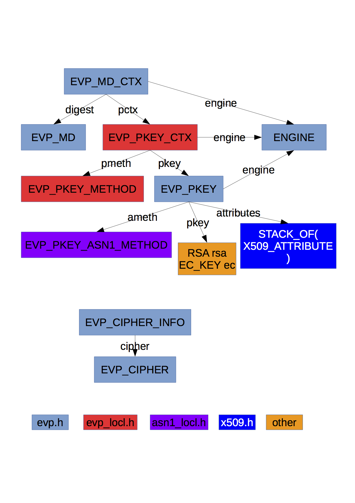

# EVP PKEY

Following is the relationship graph of the major structures in EVP.



The type `EVP_PKEY *` is an alias of `struct evp_pkey_st *`. This structure contains two important fields: `pkey` and `ameth`. Integer fields `type` and `save_type` indicate the type of public key this is. The `pkey` is a `union` type, and one of the fields is `void * ptr`, which is used to assign any type of public key pointers to this field, without causing the compiler to complain about pointer type mismatch.

To generate a new `EVP_PKEY` structure, use `EVP_PKEY_new()`. This initializes all fields to `NULL`. To assign a public key of specific type (like `RSA` or `EC_KEY`) to an `EVP_PKEY`, methods like `EVP_PKEY_set_EC_KEY()` are actually macros of `EVP_PKEY_assign()`, with one argument differs: the `type`. The `EVP_PKEY_assign()` directly set the `pkey` union to whatever pointer passed to it, and call the `EVP_PKEY_set_type()` method, which is just an encapsulation of `pkey_set_type()`. That is what is different for various type of public keys!

The `pkey_set_type()` method mainly deals with two tasks: find the corresponding `ASN1_METHOD` and the corresponding `ENGINE` for the type. These two tasks are finished by one call to `EVP_PKEY_asn1_find()`. A pointer of pointer of type `ENGINE` is passed as the first argument to receive the found engine, and the return value is the `EVP_PKEY_ASN1_METHOD` found. If found, the `ameth` and `engine` fields are set to the results. The `type` is set not to the `type` passed to this method, but to `ameth->pkey_id`, i.e. the type of the method structure, while the `save_type` field is set to the `type` argument.

Note that at this time, the most important methods such as `sign`, `verify`, `encrypt` and `decrypt` are still not set yet.

Before continue to find more places where the implementation differs for different types of public keys, let's first explore the details of `EVP_PKEY_ASN1_METHOD` structure and the `EVP_PKEY_asn1_find()` method. The former is an alias of `evp_pkey_asn1_method_st` which is defined in `asn1_locl.h`. Recall that this means you cannot access the fields of this structure. They are reserved for OpenSSL developers. This structure contains little more than tons of function pointers, mainly used to encode and decode the public keys, private keys and the parameters. Note that encoding and decoding is basically what `ASN1` does. These function pointers will get invoked when you are trying to encode or decode the `EVP_PKEY` structure.

Now it's time to explore the `sign` procedure. First give a simplified example of how to use `EVP_PKEY` to sign.
```C
EVP_PKEY_CTX *pctx;
EVP_PKEY *pkey;
EC_KEY *ec_key = NULL;
unsigned char dgst[32];
unsigned char sig[256]; /* Should be enough to contain the signature */
size_t siglen = 256;

/* Assume that ec_key, dgst is set properly */

pkey = EVP_PKEY_new();
EVP_PKEY_set1_EC_KEY(pkey,ec_key);

pctx = EVP_PKEY_CTX_new(pkey,NULL);
EVP_PKEY_sign_init(pctx);
EVP_PKEY_sign(pctx,sig,&siglen,dgst,32);

```
All error handling codes are omitted here.

After the `EVP_PKEY` is set properly, we just need three lines of code. There is sufficient reason to suspect that it is `EVP_PKEY_CTX_new()` that deals with all the type-specific thing. In `pmeth_lib.c`, we can find that `EVP_PKEY_CTX_new()` is an encapsulation around an inner function `int_ctx_new()`. The second argument is a pointer to type `ENGINE`, which could be `NULL`, so we just set it to be `NULL`. We don't have to worry about `ENGINE` at present.

The structure `EVP_PKEY_CTX` is an alias of `evp_pkey_ctx_st`, which contains a pointer to `EVP_PKEY_METHOD` and a pointer to `EVP_PKEY`. The `EVP_PKEY_METHOD` pointer field is named `pmeth`, similar to `ameth` in `EVP_PKEY`. The `EVP_PKEY_METHOD` is alias of `evp_pkey_method_st` and is similar to `EVP_PKEY_ASN1_METHOD`, containing tons of function pointers including `keygen`, `sign`, `verify`, `encrypt`, etc. That is what is going to be invoked to do real things with `EVP_PKEY`!

The line setting the `pmeth` field in `int_ctx_new` is `pmeth = EVP_PKEY_meth_find(id)` where `id` corresponds to the `type` in the `EVP_PKEY`. This verifies our guess that `EVP_PKEY_CTX_new()` is where the difference of various types of public keys is handled. After the `pmeth` is set, the `EVP_PKEY_sign_init()` and `EVP_PKEY_sign()` is easily implemented by invoking the `sign_init()` and `sign()` function pointers in `pmeth`.

Now we look into the `EVP_PKEY_meth_find()` method. We can immediately note the method `OBJ_bsearch_pmeth()` is the kernel of this function. This `OBJ_bsearch_pmeth()` comes from `objects.h`, and unfortunately the name is found nowhere defined and is most probably defined automatically by macros, which we don't want to bother to peruse. Yet we have sufficient reasons to believe that this method does some kind of binary search in an array `standard_methods` which is defined dozens of lines above, and the comparison is based on the `pkey_id` field, since this is the only field specified. So the idea of this method is simple: declare a new `EVP_PKEY_METHOD` structure (not pointer), set the type as the hint, and use binary search to find a pointer to a complete structure based on the hint, then return the found pointer as constant. We can guess that the `EVP_PKEY_METHOD` pointers in the `standard_methods` are sorted by their `pkey_id`. When the program runs, the structure bodies are stored in the heap as global static variables and are referenced by constant pointers. The declaration of the structure bodies in `pmeth_lib` are modified by `extern`. The real definitions lie in the implementation directories of the specific algorithms. For example, the definition `const EVP_PKEY_METHOD rsa_pkey_meth` is in `rsa_pmeth.c` in the directory `rsa`. The function pointers are also implemented in the same source file. The `pkey_id` is `EVP_PKEY_RSA`, which is defined in `evp.h` together with other `pkey_id`.

Similarly, the `EVP_PKEY_asn1_find()` method invokes `pkey_asn1_find()` which uses a similar `OBJ_bsearch_ameth()`. The `standard_methods` are defined alike, and the real entities of the `EVP_PKEY_ASN1_METHOD` structures are defined in files like `rsa_ameth.c`.
