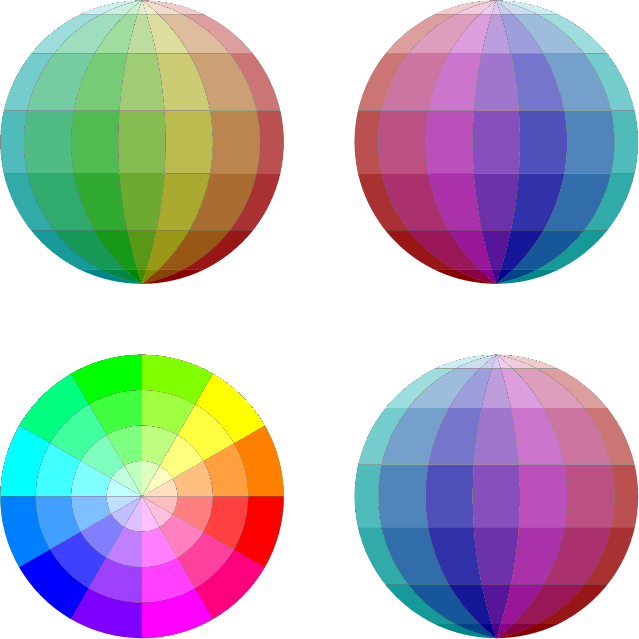
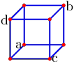
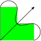
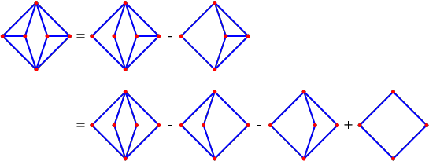
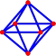
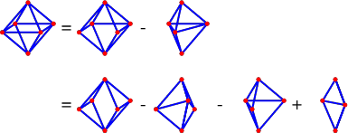
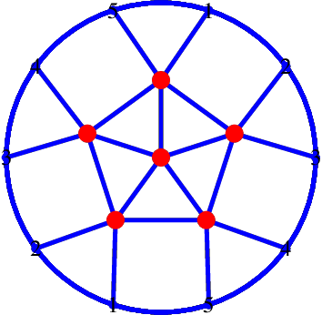
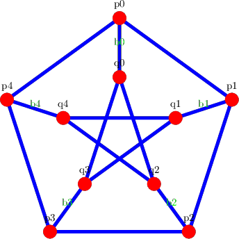
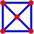

```
outputformat := "eps";
prologues := 3;
outputtemplate := "%j-%c.eps";
defaultscale := 2pt;
u:= 5cm;

beginfig(1);

vardef hsv_color(expr h,s,v) =
    % following wikipedia article on "HSL and HSV"
	save chroma, hh, x, m;
	chroma = v*s;
	hh = h/60;
	x  = chroma * (1-abs(hh mod 2 - 1));
	m  = v - chroma;
	if     hh < 1: (chroma,x,0)+(m,m,m)
	elseif hh < 2: (x,chroma,0)+(m,m,m)
	elseif hh < 3: (0,chroma,x)+(m,m,m)
	elseif hh < 4: (0,x,chroma)+(m,m,m)
	elseif hh < 5: (x,0,chroma)+(m,m,m)
	else:          (chroma,0,x)+(m,m,m)
	fi
enddef;

pickup pencircle scaled 0.1pt;

path p[];
path q[];
path l[];
path m[];
path r[];
path n[];
path c[];
path d[];
path s[];
p0 = (0,1u)..(-1u,0)..(0,-1u);
q0 = p0 shifted(2.5u,0);
r0 = p0 shifted(2.5u,-2.5u);
for i=1 upto 6:
	p[i] = (0,1u)..((2*i-7)/6.0*u,0)..(0,-1u);
	q[i] = p[i] shifted(2.5u,0);
	r[i] = p[i] shifted(2.5u,-2.5u);
endfor
p7 = (0,1u)..(1u,0)..(0,-1u);
q7 = p7 shifted(2.5u,0);
r7 = p7 shifted(2.5u,-2.5u);

for i=0 upto 7:
	l[i] = (-1u,cosd(180.0/7*i)*u)--(1u,cosd(180.0/7*i)*u);
	m[i] = l[i] shifted(2.5u,0);
	n[i] = l[i] shifted(2.5u,-2.5u);
endfor;

for i=0 upto 4:
	c[i] = ((0,1.0/4.0*i*u)..(-1.0/4.0*i*u,0)..(0,-1.0/4.0*i*u)..(1.0/4.0*i*u,0)) shifted (0,-2.5u);
	d[i] = ((0,-1.0/4.0*i*u)..(1.0/4.0*i*u,0)..(0,1.0/4.0*i*u)..(-1.0/4.0*i*u,0)) shifted (0,-2.5u);
endfor;

for i=0 upto 12:
	s[i] = ((0,0)--(cosd(30*i)*2*u,sind(30*i)*2*u)) shifted (0,-2.5u);
endfor;

for h=0 upto 6:
	for s=1 upto 7:
		fill buildcycle(p[h],l[s],p[h+1],l[s-1]) withcolor hsv_color((6-h)*30,s/7.0,1-s/15.0);
		fill buildcycle(q[h],m[s],q[h+1],m[s-1]) withcolor hsv_color((12-h)*30,s/7.0,1-s/15.0);
		fill buildcycle(r[h],n[s],r[h+1],n[s-1]) withcolor hsv_color((h+6)*30,s/7.0,1-s/15.0);
	endfor
endfor

for h=1 upto 6:
	for t=1 upto 4:
		fill buildcycle(s[h],d[t],s[h-1],d[t-1]) withcolor hsv_color(h*30,t/4.0,1);
	endfor
endfor

for h=7 upto 12:
	for t=1 upto 4:
		fill buildcycle(s[h],c[t],s[h-1],c[t-1]) withcolor hsv_color(h*30,t/4.0,1);
	endfor
endfor

endfig;

end.
```


```
outputformat := "eps";
prologues := 3;
outputtemplate := "%j-%c.eps";
defaultscale := 2pt;
u:= 0.5cm;

beginfig(1);

pair move; move = (-u*sqrt(2),-u*sqrt(2));
z1=(-2u,-2u); z2=(2u,-2u);  z3=(2u,2u);   z4=(-2u,2u);
z5=z1+move; z6=z2+move; z7=z3+move; z8=z4+move;
pickup pencircle scaled 2pt;
draw z1--z2--z3--z4--cycle withcolor blue;
draw z5--z6--z7--z8--cycle withcolor blue;
draw z1--z5 withcolor blue;
draw z2--z6 withcolor blue;
draw z3--z7 withcolor blue;
draw z4--z8 withcolor blue;
pickup pencircle scaled 5pt;
draw z1 withcolor red;
draw z2 withcolor red;
draw z3 withcolor red;
draw z4 withcolor red;
draw z5 withcolor red;
draw z6 withcolor red;
draw z7 withcolor red;
draw z8 withcolor red;
label.lft("a",z1);
label.rt("b",z3);
label.rt("c",z6);
label.lft("d",z8);

endfig;

end.
```


```
outputtemplate := "%j-%c.eps";

transform pagecoords;
pagecoords:=identity scaled 10mm shifted (100mm,150mm);
beginfig (1)
    fill ((0,0)--(2,0)--(2,1)--(1,1)--(1,2)--(0,2)--cycle)
        transformed pagecoords withcolor green;
    draw ((2,0)..(2,1)..(1,1)..(1,2)..(0,2))
        transformed pagecoords;
    drawarrow ((0,0)--(2,2)) transformed pagecoords;
endfig;
beginfig (2)
    draw (for i=0 upto 7: dir (135i)-- endfor cycle)
        transformed pagecoords;
endfig;
bye
```



```
outputformat := "eps";
prologues := 3;
outputtemplate := "%j-%c.eps";
defaultfont := "ptmr8r";
u:= 3cm;

beginfig(1);

drawarrow (-2u,0)--(2u,0);
drawarrow (0,-6u)--(0,6u);

path fun;
fun = (-2u,-6u)
for i=-10 upto 10:
	..(i/5*u,((i/5)**3-i/5)*u)
endfor
;
draw fun;

path ver;
pair inter, po;
x := 1.5u;
ver := (x,-6u)--(x,6u);
draw ver;
inter := fun intersectiontimes ver;
po := fun intersectionpoint ver;
z0 = po + whatever * (direction (xpart inter) of fun);
z0 = whatever[(-2,0),(2,0)];
draw po--z0;
pickup pencircle scaled 4pt;
dotlabel.bot("x0",(x,0));
drawdot z0;
pickup pencircle scaled .5pt;

x := xpart z0;
ver := (x,-6u)--(x,6u);
draw ver;
inter := fun intersectiontimes ver;
po := fun intersectionpoint ver;
z1 = po + whatever * (direction (xpart inter) of fun);
z1 = whatever[(-2,0),(2,0)];
draw po--z1;
pickup pencircle scaled 4pt;
dotlabel.bot("x1",(x,0));
drawdot z1;
dotlabel.bot("x2",z1);
pickup pencircle scaled .5pt;


endfig;

end.
```


```
outputformat := "eps";
prologues := 3;
outputtemplate := "%j-%c.eps";
defaultfont := "ptmr8r";
defaultscale := 2pt;
u:= 0.5cm;

beginfig(1);

z1=(0,3u); z2=(-3u,0); z3=(-u,0); z4=(u,0); z5=(3u,0); z6=(0,-3u);
pair base;
base := (0,0);
pickup pencircle scaled 2pt;
draw z1+base--z2+base--z6+base--z5+base--cycle withcolor blue;
draw z1+base--z3+base withcolor blue;
draw z1+base--z4+base withcolor blue;
draw z6+base--z3+base withcolor blue;
draw z6+base--z4+base withcolor blue;
draw z2+base--z3+base withcolor blue;
draw z4+base--z5+base withcolor blue;
pickup pencircle scaled 5pt;
drawdot z1+base withcolor red;
drawdot z2+base withcolor red;
drawdot z3+base withcolor red;
drawdot z4+base withcolor red;
drawdot z5+base withcolor red;
drawdot z6+base withcolor red;
label("=",(4u,0));

base := (8u,0);

pickup pencircle scaled 2pt;
draw z1+base--z2+base--z6+base--z5+base--cycle withcolor blue;
draw z1+base--z3+base withcolor blue;
draw z1+base--z4+base withcolor blue;
draw z6+base--z3+base withcolor blue;
draw z6+base--z4+base withcolor blue;
draw z4+base--z5+base withcolor blue;
pickup pencircle scaled 5pt;
drawdot z1+base withcolor red;
drawdot z2+base withcolor red;
drawdot z3+base withcolor red;
drawdot z4+base withcolor red;
drawdot z5+base withcolor red;
drawdot z6+base withcolor red;
label("-",(12u,0));

base := (16u,0);

pickup pencircle scaled 2pt;
draw z1+base--z2+base--z6+base--z5+base--cycle withcolor blue;
draw z1+base--z4+base withcolor blue;
draw z6+base--z4+base withcolor blue;
draw z4+base--z5+base withcolor blue;
pickup pencircle scaled 5pt;
drawdot z1+base withcolor red;
drawdot z2+base withcolor red;
drawdot z4+base withcolor red;
drawdot z5+base withcolor red;
drawdot z6+base withcolor red;
label("=",(4u,-8u));

base := (8u,-8u);


pickup pencircle scaled 2pt;
draw z1+base--z2+base--z6+base--z5+base--cycle withcolor blue;
draw z1+base--z3+base withcolor blue;
draw z1+base--z4+base withcolor blue;
draw z6+base--z3+base withcolor blue;
draw z6+base--z4+base withcolor blue;
pickup pencircle scaled 5pt;
drawdot z1+base withcolor red;
drawdot z2+base withcolor red;
drawdot z3+base withcolor red;
drawdot z4+base withcolor red;
drawdot z5+base withcolor red;
drawdot z6+base withcolor red;
label("-",(12u,-8u));

base := (16u,-8u);


pickup pencircle scaled 2pt;
draw z1+base--z2+base--z6+base--z5+base--cycle withcolor blue;
draw z1+base--z3+base withcolor blue;
draw z6+base--z3+base withcolor blue;
pickup pencircle scaled 5pt;
drawdot z1+base withcolor red;
drawdot z2+base withcolor red;
drawdot z3+base withcolor red;
drawdot z5+base withcolor red;
drawdot z6+base withcolor red;
label("-",(20u,-8u));

base := (24u,-8u);

pickup pencircle scaled 2pt;
draw z1+base--z2+base--z6+base--z5+base--cycle withcolor blue;
draw z1+base--z4+base withcolor blue;
draw z6+base--z4+base withcolor blue;
pickup pencircle scaled 5pt;
drawdot z1+base withcolor red;
drawdot z2+base withcolor red;
drawdot z4+base withcolor red;
drawdot z5+base withcolor red;
drawdot z6+base withcolor red;
label("+",(28u,-8u));

base := (32u,-8u);

pickup pencircle scaled 2pt;
draw z1+base--z2+base--z6+base--z5+base--cycle withcolor blue;
pickup pencircle scaled 5pt;
drawdot z1+base withcolor red;
drawdot z2+base withcolor red;
drawdot z5+base withcolor red;
drawdot z6+base withcolor red;
endfig;


end.
```


```
outputformat := "eps";
prologues := 3;
outputtemplate := "%j-%c.eps";
defaultfont := "ptmr8r";
defaultscale := 2pt;
u:= 0.5cm;

beginfig(1);

z1=(-2u,-u/3); z2=(u,-u/3); z3=(2u,u/3); z4=(-u,u/3); z5=(0,2u); z6=(0,-2u);
pickup pencircle scaled 2pt;
draw z1--z2--z3--z4--cycle withcolor blue;
draw z5--z1--z6--z4--cycle withcolor blue;
draw z5--z2--z6--z3--cycle withcolor blue;
pickup pencircle scaled 5pt;
draw z1 withcolor red;
draw z2 withcolor red;
draw z3 withcolor red;
draw z4 withcolor red;
draw z5 withcolor red;
draw z6 withcolor red;

endfig;

beginfig(2);

pair base;
z1=(-2u,-u/3); z2=(u,-u/3); z3=(2u,u/3); z4=(-u,u/3); z5=(0,2u); z6=(0,-2u);
base := (0,0);
pickup pencircle scaled 2pt;
draw z1+base--z2+base--z3+base--z4+base--cycle withcolor blue;
draw z5+base--z1+base--z6+base--z4+base--cycle withcolor blue;
draw z5+base--z2+base--z6+base--z3+base--cycle withcolor blue;
pickup pencircle scaled 5pt;
draw z1+base withcolor red;
draw z2+base withcolor red;
draw z3+base withcolor red;
draw z4+base withcolor red;
draw z5+base withcolor red;
draw z6+base withcolor red;
label("=",(3u,0));
base := (6u,0);
pickup pencircle scaled 2pt;
draw z2+base--z3+base--z4+base--z1+base withcolor blue;
draw z5+base--z1+base--z6+base--z4+base--cycle withcolor blue;
draw z5+base--z2+base--z6+base--z3+base--cycle withcolor blue;
pickup pencircle scaled 5pt;
draw z1+base withcolor red;
draw z2+base withcolor red;
draw z3+base withcolor red;
draw z4+base withcolor red;
draw z5+base withcolor red;
draw z6+base withcolor red;
label("-",(9u,0));
base := (12u,0);
z7 = 0.5[z1,z2];
pickup pencircle scaled 2pt;
draw z7+base--z3+base--z4+base--cycle withcolor blue;
draw z5+base--z7+base--z6+base--z4+base--cycle withcolor blue;
draw z5+base--z3+base--z6+base withcolor blue;
pickup pencircle scaled 5pt;
draw z7+base withcolor red;
draw z3+base withcolor red;
draw z4+base withcolor red;
draw z5+base withcolor red;
draw z6+base withcolor red;
label("=",(3u,-6u));
base := (6u,-6u);
pickup pencircle scaled 2pt;
draw z2+base--z3+base withcolor blue;
draw z4+base--z1+base withcolor blue;
draw z5+base--z1+base--z6+base--z4+base--cycle withcolor blue;
draw z5+base--z2+base--z6+base--z3+base--cycle withcolor blue;
pickup pencircle scaled 5pt;
draw z1+base withcolor red;
draw z2+base withcolor red;
draw z3+base withcolor red;
draw z4+base withcolor red;
draw z5+base withcolor red;
draw z6+base withcolor red;
label("-",(9u,-6u));
base := (12u,-6u);
z8=0.5[z3,z4];
pickup pencircle scaled 2pt;
draw z2+base--z8+base--z1+base withcolor blue;
draw z5+base--z1+base--z6+base--z8+base--cycle withcolor blue;
draw z5+base--z2+base--z6+base--z8+base--cycle withcolor blue;
pickup pencircle scaled 5pt;
draw z1+base withcolor red;
draw z2+base withcolor red;
draw z8+base withcolor red;
draw z5+base withcolor red;
draw z6+base withcolor red;
label("-",(15u,-6u));
base := (18u,-6u);
pickup pencircle scaled 2pt;
draw z3+base--z4+base--z7+base withcolor blue;
draw z5+base--z7+base--z6+base--z4+base--cycle withcolor blue;
draw z5+base--z3+base--z6+base withcolor blue;
pickup pencircle scaled 5pt;
draw z7+base withcolor red;
draw z3+base withcolor red;
draw z4+base withcolor red;
draw z5+base withcolor red;
draw z6+base withcolor red;
label("+",(21u,-6u));
base := (24u,-6u);
pickup pencircle scaled 2pt;
draw 0.5[z3,z7]+base--z4+base--cycle withcolor blue;
draw z5+base--0.5[z3,z7]+base--z6+base--z4+base--cycle withcolor blue;
draw z5+base--0.5[z3,z7]+base--z6+base withcolor blue;
pickup pencircle scaled 5pt;
draw 0.5[z3,z7]+base withcolor red;
draw z4+base withcolor red;
draw z5+base withcolor red;
draw z6+base withcolor red;

endfig;

end.
```



```
outputformat := "eps";
prologues := 3;
outputtemplate := "%j-%c.eps";
defaultfont := "ptmr8r";
%defaultscale := 1.5;
u:= 3cm;


beginfig(1);
pair c;
pair p[],r[];
c = (0,0);
for i=0 upto 4:
	x := u*sind(72*i);
	y := u*cosd(72*i);
	p[i]:=(x,y);
	r[2*i]:=2*u*(sind(72*i-18),cosd(72*i-18));
	r[2*i+1]:=2*u*(sind(72*i+18),cosd(72*i+18));
endfor

pickup pencircle scaled 5pt
draw p0--p1--p2--p3--p4--cycle withcolor blue;
%draw q0--q1--q2--q3--q4--cycle withcolor blue;
for i=0 upto 4:
	pickup pencircle scaled 5pt;
	draw c--p[i] withcolor blue;
	draw p[i]--r[2*i] withcolor blue;
	draw p[i]--r[2*i+1] withcolor blue;
	draw fullcircle scaled 4u withcolor blue;
	pickup pencircle scaled 20pt;
	drawdot p[i] withcolor red;
	pickup pencircle scaled 10pt;
	drawdot r[2i] withcolor blue;
	drawdot r[2i+1] withcolor blue;
endfor
pickup pencircle scaled 20pt;
drawdot c withcolor red;
for i=0 upto 4:
	label(decimal((i-1) mod 5 + 1) infont defaultfont scaled 2.5, r[i]);
	label(decimal((i-1) mod 5 + 1) infont defaultfont scaled 2.5, r[i+5]);
endfor

endfig;

end.
```


```
% input "latex.mp";

outputformat := "eps";
prologues := 3;
outputtemplate := "%j-%c.eps";
%defaultscale := 1.5;
u:= 3cm;


beginfig(1);

pair p[],q[];
for i=0 upto 4:
	x := u*sind(72*i);
	y := u*cosd(72*i);
	p[i]=(2*x,2*y);
	q[i]=(x,y);
endfor

pickup pencircle scaled 5pt
draw p0--p1--p2--p3--p4--cycle withcolor blue;
draw q0--q2--q4--q1--q3--cycle withcolor blue;
for i=0 upto 4:
	pickup pencircle scaled 5pt
	draw p[i]--q[i] withcolor blue;
	label.top(("b"&decimal(i)) infont defaultfont scaled 1.5, 0.5[p[i],q[i]])
		withcolor green;
	pickup pencircle scaled 20pt
	drawdot p[i] withcolor red;
	drawdot q[i] withcolor red;
	label.top(("p"&decimal(i)) infont defaultfont scaled 1.5, p[i]+(0,10));
	label.top(("q"&decimal(i)) infont defaultfont scaled 1.5, q[i]+(0,10));
endfor


endfig;

end.
```


```
outputformat := "eps";
prologues := 3;
outputtemplate := "%j-%c.eps";
%defaultscale := 1.5;
u:= 3cm;


beginfig(1);

pair p[],q[],r[];
for i=0 upto 4:
	x := u*sind(72*i);
	y := u*cosd(72*i);
	p[i]:=(2*x,2*y);
	q[i]:=(x,y);
	r[2*i]:=2.5*u*(sind(72*i-18),cosd(72*i-18));
	r[2*i+1]:=2.5*u*(sind(72*i+18),cosd(72*i+18));
endfor

pickup pencircle scaled 5pt
%draw p0--p1--p2--p3--p4--cycle withcolor blue;
draw q0--q1--q2--q3--q4--cycle withcolor blue;
for i=0 upto 4:
	pickup pencircle scaled 5pt
	draw p[i]--q[i] withcolor blue;
	draw p[i]--r[2*i] withcolor blue;
	draw p[i]--r[2*i+1] withcolor blue;
	draw fullcircle scaled 5u withcolor blue;
	label.top(("b"&decimal(i)) infont defaultfont scaled 1.5, 0.5[p[i],q[i]])
		withcolor green;
	pickup pencircle scaled 20pt
	drawdot p[i] withcolor red;
	drawdot q[i] withcolor red;
	pickup pencircle scaled 10pt;
	drawdot r[2i] withcolor blue;
	drawdot r[2i+1] withcolor blue;
	label.top(("p"&decimal(i)) infont defaultfont scaled 1.5, p[i]+(0,10));
	label.top(("q"&decimal(i)) infont defaultfont scaled 1.5, q[i]+(0,10));
endfor
for i=0 upto 4:
	label(decimal((i-1) mod 5 + 1) infont defaultfont scaled 1.5, r[i]);
	label(decimal((i-1) mod 5 + 1) infont defaultfont scaled 1.5, r[i+5]);
endfor

endfig;

end.
```


```
outputformat := "eps";
prologues := 3;
outputtemplate := "%j-%c.eps";
defaultscale := 2pt;
u:= 0.5cm;

beginfig(1);

z1=(-u,u); z2=(-u,-u); z3=(u,-u); z4=(u,u); z5=(0,0);

pickup pencircle scaled 2pt;
draw z1--z2--z3--z4--cycle withcolor blue;
draw z1--z5 withcolor blue;
draw z2--z5 withcolor blue;
draw z3--z5 withcolor blue;
draw z4--z5 withcolor blue;
pickup pencircle scaled 5pt;
draw z1 withcolor red;
draw z2 withcolor red;
draw z3 withcolor red;
draw z4 withcolor red;
draw z5 withcolor red;

endfig;


end.
```


