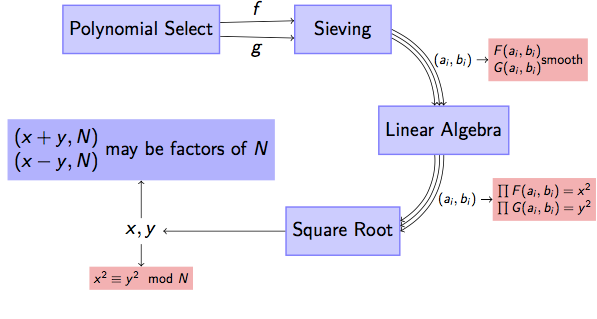
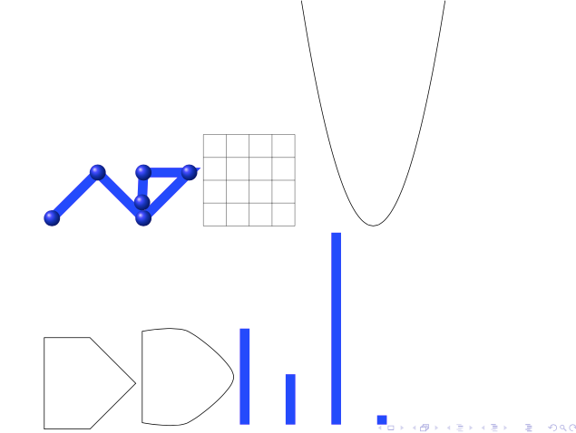
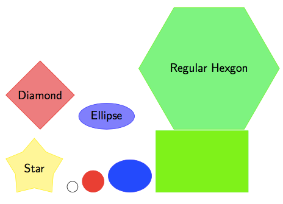
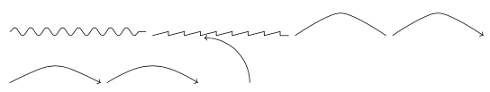
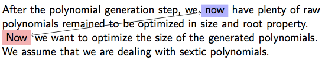
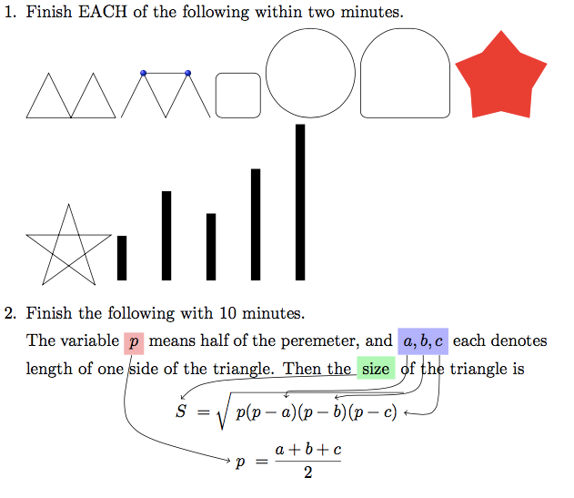
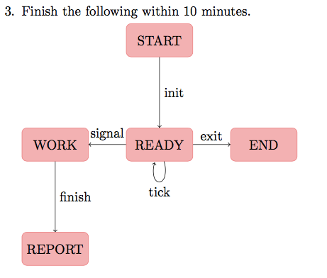
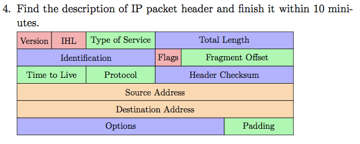

# Basic Usage of Tikz in LaTeX

```latex
\usepackage{tikz}
\usetikzlibrary{shapes}
\usetikzlibrary{snakes}
```

## Charts

```latex
\begin{tikzpicture}
	\tikzstyle{every entity}=[draw=blue!50,fill=blue!20,thick]
	\node[entity] (selector) at (0,0) {Polynomial Select};
	\node[entity] (sievor)   at (4,0) {Sieving};
	\node[entity] (linear)   at (6,-2) {Linear Algebra};
	\node[entity] (sqrtor)   at (4,-4) {Square Root};
	\node (xy) at (0,-4) {$x,y$};

	\draw[->] (selector.5) to node[above]{$f$} (sievor.170);
	\draw[->] (selector.-5) to node[below]{$g$} (sievor.190);
	\draw[->,bend left] (sievor.0) to node[scale=0.7,right](aibi1){$(a_i,b_i)$} (linear.90);
	\draw[->,bend left] (sievor.-5) to (linear.100);
	\draw[->,bend left] (sievor.-10) to (linear.110);
	\draw[->,bend left] (linear.270) to node[scale=0.7,right](aibi2){$(a_i,b_i)$} (sqrtor.0);
	\draw[->,bend left] (linear.260) to (sqrtor.5);
	\draw[->,bend left] (linear.250) to (sqrtor.10);
	\draw[->] (sqrtor) to (xy);

	\node[scale=0.7,right of=aibi1,anchor=west,fill=red!30] (FG1) {$\begin{matrix}F(a_i,b_i)\\G(a_i,b_i)\end{matrix}$smooth};
	\draw[->] (aibi1) to (FG1);
	\node[scale=0.7,right of=aibi2,anchor=west,fill=red!30] (FG2) {$\begin{matrix}\prod F(a_i,b_i)=x^2\\\prod G(a_i,b_i)=y^2\end{matrix}$};
	\draw[->] (aibi2) to (FG2);
	\node[scale=0.7,below of=xy,anchor=north,fill=red!30] (divided) {$x^2\equiv y^2\mod{N}$};
	\draw[->] (xy) to (divided);
	\node[fill=blue!30,above of=xy,anchor=south] (result) {$\begin{matrix}(x+y,N)\\(x-y,N)\end{matrix}$ may be factors of $N$};
	\draw[->] (xy) to (result);
\end{tikzpicture}
```



## Shapes

```latex
\tikz \draw[color=blue,mark=ball,line width=6pt,mark size=5] plot coordinates {(0,0) (1,1) (2,0) (3,1) (2,1) (10:2cm)};
\tikz \draw[color=gray,scale=0.5] (0.0,0.0) grid (4.0,4.0);
\tikz \draw[domain=-3.141:3.141,smooth,variable=\t,scale=0.5] plot ({\t},{\t*\t)});
\tikz \draw plot coordinates {(0,0) (1,0) (2,1) (1,2) (0,2)} -- cycle;
\tikz \draw[smooth] plot coordinates {(0,0) (1,0) (2,1) (1,2) (0,2)} -- cycle;
\tikz \draw[ycomb,color=blue,line width=6pt] plot coordinates {(1,2.1) (2,1.1) (3,4.2) (4,0.2)};
```


```latex
\tikzstyle{every node}=[draw=blue!50,fill=red!50]
\tikz \node[shape=diamond,draw=red,fill=red!50] {Diamond};
\tikz \node[shape=ellipse,draw=blue,fill=blue!50] {Ellipse};
\tikz \node[regular polygon,regular polygon sides=6,draw=green,fill=green!50] {Regular Hexgon};
\tikz \node[shape=star,star points=5,draw=yellow,fill=yellow!50] {Star};
\tikz \draw (0,0) circle (5pt);
\tikz \filldraw[color=red] (0,0) circle (10pt);
\tikz \filldraw[color=blue] (0,0) ellipse (20pt and 15pt);
\tikz \filldraw[color=green] (0,0) rectangle (3,2);
```



```latex
\tikz \draw[snake=snake] (0,0)--(3,0);
\tikz \draw[snake=saw] (0,0)--(3,0);
\tikz \draw[smooth] plot coordinates {(0,0) (1,0.5) (2,0)};
\tikz \draw[smooth,->] plot coordinates {(0,0) (1,0.5) (2,0)};
\tikz \draw[->] (0,0) .. controls (1,0.5) .. (2,0);
\tikz \draw[->] (0,0) .. controls (0.8,0.5) and (1.2,0.5) .. (2,0);
\tikz \draw[->] (1,0) arc (0:90:1);
```



## Text Decoration

```latex
After the polynomial generation step, we \tikz[baseline]{\node[anchor=base,fill=blue!30](n1){now};}
have plenty of raw polynomials remained to be optimized in size and root property.

\tikz[baseline]{\node[anchor=base,fill=red!30](n2){Now};} we want to optimize the size of the generated polynomials.
We assume that we are dealing with sextic polynomials.

\begin{tikzpicture}[overlay]
	\path[<->] (n1) edge (n2);
\end{tikzpicture}
```



## Test





```latex
\documentclass[11pt]{article}
\usepackage{tikz}
\usetikzlibrary{shapes}
\usetikzlibrary{er}

\begin{document}
\begin{enumerate}
\item Finish EACH of the following within two minutes.

\tikz \draw (0,0)--(1,0)--(2,0)--(1.5,1)--(1,0)--(0.5,1)--cycle;
\tikz {\draw (0,0)--(0.5,1)--(1,0)--(1.5,1)--(2,0); \draw[mark=ball] plot coordinates {(0.5,1) (1.5,1)};}
\tikz \draw[rounded corners] (0,0)--(1,0)--(1,1)--(0,1)--cycle;
\tikz \draw (0,0) circle (1);
\tikz \draw[rounded corners] (0,0)--(2,0)--(2,1) arc (0:90:1) arc (90:180:1) -- (0,1)--cycle;
\tikz \node[shape=star,fill=red,scale=4] { };
\tikz \draw (18:1) -- (162:1) -- (306:1) -- (90:1) -- (234:1) -- cycle;
\tikz \draw[ycomb,line width=6pt] plot coordinates {(0,1) (1,2) (2,1.5) (3,2.5) (4,3.5)};

\item Finish the following within 10 minutes.

The variable \tikz[baseline,remember picture]{\node[anchor=base,fill=red!30](p){$p$}} means half of the peremeter,
and \tikz[baseline,remember picture]{\node[anchor=base,fill=blue!30](abc){$a,b,c$}} each denotes length of one side of the triangle.
Then the \tikz[baseline,remember picture]{\node[anchor=base,fill=green!30](size){size}} of the triangle is
\[\tikz[baseline,remember picture]{\node[anchor=base](s){$S$}}=\sqrt{\tikz[baseline,remember picture]{\node[anchor=base](pabc){$p(p-a)(p-b)(p-c)$}}}\]
\[\tikz[baseline,remember picture]{\node[anchor=base](pabc2){$p$}}=\frac{a+b+c}{2}\]
\begin{tikzpicture}[remember picture,overlay]
  \draw[->] (p) .. controls +(-0.4,-2) .. (pabc2);
  \draw[->] (abc.220) .. controls +(0,-0.8) .. +(-2.5,-0.8) .. controls +(-0.2,0) .. (pabc.155);
  \draw[->] (abc.270) .. controls +(0,-0.9) .. +(-1.5,-0.9) .. controls +(-0.2,0) .. (pabc.40);
  \draw[->] (abc.320) .. controls +(0,-1.4) .. (pabc.0);
  \draw[->] (size.200) .. controls +(-3.5,-0.1) .. (s.90);
\end{tikzpicture}

\item Finish the following within 10 minutes.

  \begin{tikzpicture}[node distance=3cm]
	\tikzstyle{every entity}=[fill=red!30,draw=red!50,rounded corners]
	\node[entity] (start) at (0,0) {START};
	\node[entity,below of=start] (ready) {READY};
	\node[entity,left of=ready] (work) {WORK};
	\node[entity,right of=ready] (end) {END};
	\node[entity,below of=work] (report) {REPORT};

	\draw[->] (start) -- node[right]{init} (ready);
	\draw[->] (ready) -- node[above]{signal} (work);
	\draw[->] (ready) -- node[above]{exit} (end);
	\draw[->] (work) -- node[right]{finish} (report);
	\draw[->] (ready) edge[loop below] node[below]{tick} ();
  \end{tikzpicture}

\item Find the description of IP packet header and finish it within 10 miniutes.

  \begin{tikzpicture}
	\draw[fill=red!30] (0,0) rectangle +(1.2,-0.6);
	\draw[fill=red!30] (1.2,0) rectangle +(1.2,-0.6);
	\draw[fill=green!30] (2.4,0) rectangle +(2.4,-0.6);
	\draw[fill=blue!30] (4.8,0) rectangle +(4.8,-0.6);
	\node[scale=0.8] at (0.6,-0.3) {Version};
	\node[scale=0.8] at (1.8,-0.3) {IHL};
	\node[scale=0.8] at (3.6,-0.3) {Type of Service};
	\node[scale=0.8] at (7.2,-0.3) {Total Length};

	\draw[fill=blue!30] (0,-0.6) rectangle +(4.8,-0.6);
	\draw[fill=red!30] (4.8,-0.6) rectangle +(0.9,-0.6);
	\draw[fill=green!30] (5.7,-0.6) rectangle +(3.9,-0.6);
	\node[scale=0.8] at (2.4,-0.9) {Identification};
	\node[scale=0.8] at (5.25,-0.9) {Flags};
	\node[scale=0.8] at (7.65,-0.9) {Fragment Offset};

	\draw[fill=green!30] (0,-1.2) rectangle +(2.4,-0.6);
	\draw[fill=green!30] (2.4,-1.2) rectangle +(2.4,-0.6);
	\draw[fill=blue!30] (4.8,-1.2) rectangle +(4.8,-0.6);
	\node[scale=0.8] at (1.2,-1.5) {Time to Live};
	\node[scale=0.8] at (3.6,-1.5) {Protocol};
	\node[scale=0.8] at (7.2,-1.5) {Header Checksum};

	\draw[fill=orange!30] (0,-1.8) rectangle +(9.6,-0.6);
	\node[scale=0.8] at (4.8,-2.1) {Source Address};

	\draw[fill=orange!30] (0,-2.4) rectangle +(9.6,-0.6);
	\node[scale=0.8] at (4.8,-2.7) {Destination Address};

	\draw[fill=blue!30] (0,-3.0) rectangle +(7.2,-0.6);
	\draw[fill=green!30] (7.2,-3.0) rectangle +(2.4,-0.6);
	\node[scale=0.8] at (3.6,-3.3) {Options};
	\node[scale=0.8] at (8.4,-3.3) {Padding};
  \end{tikzpicture}

\end{enumerate}

\end{document}
```
