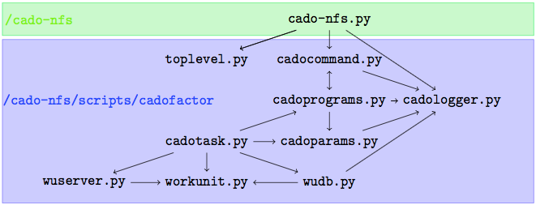
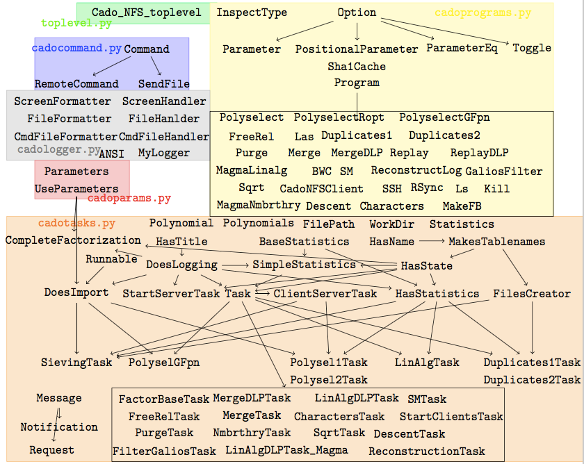
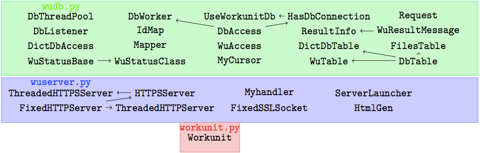

# Code Reading: Structure of CADO-NFS

## Introduction

`CADO-NFS` is an implementation of the General Number Field Sieve
algorithm, which is developed for factoring large integers. Currently
only linux OS is supported. Download the latest package from
<http://cado-nfs.gforge.inria.fr/>, decompress into any directory you
like. To compile, simply enter the `cado-nfs` directory and execute
`make`.

This system consists of modules written in C++ and python scripts
organizing the modules together. Each module is a standalone executable
program. You can directly invoke the modules specifying all the command
line parameters by yourself, or save your effort by making use of the
python scripts.

For factoring relatively small integers, the script at the root
directory `cado-nfs.py` should work, using all cores on the local
machine.

    $ ./cado-nfs.py \
    90377629292003121684002147101760858109247336549001090677693

For a larger factorization distributed on several machines, save the
parameters in a file `parameterfile` and execute

    $ ./cado-nfs.py parameterfile

It is possible to specify parameters on the command line after
`parameterfile`. Example parameter files are given in
`scripts/cadofactor/` and `parameters/factor/`.

When `cado-nfs` is running, a server is started on the local machine.
Several clients may be started to assist the computation. Clients can be
in the local or remote machines. Clients can be started manually from
command line. If you want to let the server automatically start clients,
you need to supply a list of hostnames on which to start clients, e.g.,

    $ ./cado-nfs.py \
    90377629292003121684002147101760858109247336549001090677693 \
    tasks.workdir=/tmp/c59 slaves.nrclients=2 slaves.hostnames=localhost

## Script Files

### Dependence relation of script files



### Dependence relation of classes





cado-nfs.py
-----------

This script is at the top level. It checks and sets the environment
based on the given command line parameters. No class is defined in this
script.

In this script, the following two lines:

```python
factorjob = cadotask.CompleteFactorization(db=wudb_file,
                                           parameters = parameters,
                                           path_prefix = [])
factors = factorjob.run()
```

are the core of this script. Here `CompleteFactorization` is a class
in module `cadotask`.

cadotasks.py
------------

This script file defines several base task classes like `DoesLoggin`,
`DoesImport`, `HasTitle`, etc, whose characteristics are obvious
from the name. Then a lot of task classes doing real works are defined
based on these base classes. Call them working task classes.
`CompleteFactorization` is one among them. This class will make use of
all the other working task classes.

In the `__init__` function, the task `CompleteFactorization`
will create a server. Some clients might be created to assist the
server.

The following code create the clients:

``` {language="python"}
for (path, key) in self.parameters.get_parameters().find(['slaves'], 'hostnames'):
    self.clients.append(StartClientsTask(mediator=self,
                                         db=db,
                                         parameters=self.parameters,
                                         path_prefix=path))
    hostnames = self.clients[-1].get_hosts_to_launch()
    whitelist |= set(hostnames)
```

Then the other tasks are created with code like:

```python
self.fb = FactorBaseTask(mediator=self,
                         db=db,
                         parameters=self.parameters,
                         path_prefix=sievepath)
```

Then in the `run` function of `CompleteFactorization`, the code

```python
self.servertask.run()
```

starts the server. Then

```python
self.start_all_clients()

while last_status:
    last_status, last_task = self.run_next_task()
```

launches all the clients, then starts a busy loop waiting for the status
to change. This loop is the core of the entire program.

Following is the code of `run_next_task` function

```python
    def run_next_task(self):
        for task in self.tasks:
            if task in self.tasks_that_want_to_run:
                self.tasks_that_want_to_run.remove(task)
                return [task.run(), task.title]
        return [False, None]
```

So the `task.run()` is where all the calculation is doing. Take a look
at the `run()` method of `Polysel1Task` for example. First are a lot
of checking for whether there are already polynomials imported. If so,
skip the polynomial phase directly. After that, when there is no
polynomial imported, the following code

```python
while self.need_more_wus():
    self.submit_one_wu()
while self.get_number_outstanding_wus() > 0:
    self.wait()
```

launches several `WorkUnits` and wait for them to finish the task.

While the `run()` in `MakeFB` has the following code

```python
p = cadoprograms.MakeFB(out=str(outputfilename0),
                    side=0,
                    lim=self.params["rlim"],
                    stdout=str(stdoutpath),
                    stderr=str(stderrpath),
                    **self.merged_args[0])
message = self.submit_command(p, "", log_errors=True)
if message.get_exitcode(0) != 0:
    raise Exception("Program failed")
```

in fact, most of the tasks start running the program in this format.
Let’s first look at the `submit_one_wu()` function, then we find

```python
p = cadoprograms.Polyselect(admin=adstart, admax=adend,
                            stdout=str(outputfile),
                            **self.progparams[0])
```

So basically, it is the classes in `cadoprograms.py` doing the work.
We first look at the function `submit_command`. Here is a sample of
the function body

```python
process = cadocommand.Command(command)
(rc, stdout, stderr) = process.wait()
```

So the `Command` class in the `cadocommand` module is handling the
computation processes.

cadocommand.py
--------------

In the `__init__()` method of `Command`, the following code

```python
progargs = self.program.make_command_array()
self.child = subprocess.Popen(progargs, *args, stdin=self.stdin,
    stdout=self.stdout, stderr=self.stderr, **kwargs)
```

creates the subprocess and put it in the `self.child` attribute. Then
in the `wait()` method

```python
(stdout, stderr) = self.child.communicate()
```

actually executes the program.

To understand what the process is doing, all we need is to have a look
at the `make_command_array()` method of `Program`.

### cadoprograms.py

The class inheritance structure is much simpler in this module. The base
class is `Program` and all other programs are directly inherited from
it.

The `Program` base class is oblivious to how programs get input data,
or how they provide output data. It does, however, handle redirecting
`stdin/stdout/stderr` from/to files and accepts file names to/from
which to redirect. This is done so that `workunits` can be generated
from Program instances; in the `workunit` text, shell redirection
syntax needs to be used to connect stdio to files, so a `Program`
instance needs to be aware of which file names should be used for stdio
redirection.

## Module One: Polyselect

There are three standalone executable programs (i.e. has `main`
function) in this module, `polyselect` and `polyselect_ropt`, and
the corresponding source files are `polyselect.c` and
`ropt_main.c`, respectively.

The `polyselect` program generates raw polynomials using Kleinjung’s
method and then apply size optimization. The polynomial file format is
as follows:

-   Each line is either empty, comment, or key value pair;

-   Comment line is started by `#`.

-   A key value pair is in the form of `key: value`.

-   Each polynomial is defined by a list of key value pairs starting by
    `n`, the to-be-factored integer. Then `Y1` and `Y0`, defining
    $g(x)=Y_1x^2+Y_0$. Then comes `c4,c3,…,c0`, defining
    $f(x)=c_4x^4+c_3x^3+c_2x^2+c_1x+c_0$. For different degrees the
    indices may vary.

For each polynomial, the program puts the original raw polynomial in
comments, followed by the optimized polynomial. Like the following

    # Raw polynomial:
    # n: 353493749731236273014678071260920590602836471854359
    705356610427214806564110716801866803409
    # Y1: 34554385164289
    # Y0: -8761140985868994725906
    # c4: 60
    # c3: -44
    # c2: -122597099987059
    # c1: 3642475004612919403345
    # c0: 217805892978013836619
    # raw lognorm 33.24, skew 2550784.00, alpha -0.19 (proj: -1.44),
    E 33.05, exp_E 29.54, 2 rroots
    # Size-optimized polynomial:
    n: 353493749731236273014678071260920590602836471854359705
    356610427214806564110716801866803409
    Y1: 34554385164289
    Y0: -8762878725898906819716
    c4: 720
    c3: -144835728
    c2: -1287467551051903
    c1: 34070214440641525820
    c0: 39845338409921085803795148
    # lognorm 32.40, skew 484992.00, alpha -0.68 (proj: -1.73), E 31.71,
    exp_E 29.40, 4 rroots

### polyselect.c

At the beginning of the `main()` function the command line parameters
are processed. The Kleinjung’s method takes parameters

-   $d$: degree of the polynomial

-   $N$: large integer $N$ to be factored

-   $a_{d_{\min}},a_{d_{\max}}$: Range of the leading
    coefficient

It then generates a large number of polynomials of degree $d$ and
leading coefficients lying in $[a_{d_{\min}},a_{d_{\max}}]$. The
corresponding command line arguments are `-degree,-admin,-admax`
respectively. There is also an argument `-incr` specifying distance
between two adjacent choices of $a_d$’s.

It is required that the degree one coefficient of $g(x)$ has two prime
factors in $[P,2P]$ where $P$ is an integer, and is provided by the
command line option `-P`.

When all the arguments are set, the program start threads by system call
`pthread_create()`, which executes a procedure and returns a success
code. Here the procedure is function `void * one_thread(void *
args)`.

```c
int i;
for (i = 0; i < nthreads; i++)
    pthread_create (tid[i], NULL, one_thread, (void *) (T+i));
for (i = 0; i < nthreads; i++)
    pthread_join (tid[i], NULL);
```

The parameter `args` are specified as an argument to
`pthread_create()` and then parsed automatically by
`pthread_create()` to `one_thread()`.

The system call `pthread_join` are then invoked to wait for the
threads to terminate.

Following is the definition of `one_thread()`.

```c
void*
one_thread (void* args)
{
    tab_t *tab = (tab_t*) args;
    while (next_ad (tab[0]->ad, tab[0]->thread))
        newAlgo (tab[0]->N, tab[0]->d, tab[0]->ad);
    return NULL;
}
```

where `next_ad` find if there is new $a_d$. If not, return 0, else,
put the next $a_d$ into `tab[0]-&gt;ad`. For each $a_d$, the
function `newAlgo()` is called.

```c
static void
newAlgo (mpz_t N, unsigned long d, mpz_t ad)
{
    unsigned long c = 0;
    header_t header;
    proots_t R;

    header_init (header, N, d, ad);
    proots_init (R, lenPrimes);

    if (sizeof (unsigned long int) == 8) {
        c = collision_on_p (header, R);
        if (nq > 0)
            collision_on_sq (header, R, c);
    }
    else {
        c = gmp_collision_on_p (header, R);
        if (nq > 0)
            gmp_collision_on_sq (header, R, c);
    }

    proots_clear (R, lenPrimes);
    header_clear (header);
}
```

If we keep diving in and in, we will finally find the `match()` or
`gmp_match()` function which generates a single polynomial and
size-optimize it. And both of the two functions call the same
`optimize_raw_poly()` function for the size optimization. This is
defined in the file `size_optimization.c`.

### size_optimization.c

The core function in this file is `size_optimization_aux()`. This
function takes `f_opt,g_opt` of type `mpz_poly_ptr` to output
optimized polynomials, `f_raw,g_raw` of type `mpz_poly_srcptr`
as input polynomial. The return value is the skew log-norm of optimized
$f(x)$.

There are other parameters configuring the process of optimization. The
`unsigned int sopt_effort` enable or disable the rotation process.
`sopt_effort=0` means that only translation is considered. The `int
max_rot` means considering translation up to this degree.

The degree of $g(x)$ is expected to be $1$.

### Translation

A list of `mpz_t` integers, `list_k` is defined

```c
list_mpz_t list_k;
```

First, a number of translations are calculated and put into `list_k`,
using the method proposed in *Better Polynomials for GNFS*.

```c
list_mpz_t list_k;
if (d == 6 || d == 5)
{
    sopt_find_translations_extra (list_k, f_raw, g_raw, verbose);
    if (d == 6)
        sopt_find_translations_deg6 (list_k, f_raw, g_raw, verbose);
    else if (d == 5)
        sopt_find_translations_deg5 (list_k, f_raw, g_raw, verbose);
    mpz_set_ui (tmp, 0);
    list_mpz_append (list_k, tmp);
    list_mpz_sort_and_remove_dup (list_k, verbose);
}
else
{
    mpz_set_ui (tmp, 0);
    list_mpz_append (list_k, tmp);
}
```

The function `sopt_find_translation_extra` finds translations by
another method. All found translations are gathered in the `list_k`,
which is then sorted and deprived of repeated items.

For smaller degrees, i.e., $d\leq 4$, the translation is omitted.

Next, let us have a look at the function
`sopt_find_translations_extra`.

```c
static void
sopt_find_translations_extra (list_mpz_t list_k, mpz_poly_srcptr f0,
                              mpz_poly_srcptr g, const int verbose)
{
  int d = f0->deg;
  double cd, cdm1, cdm2, cdm3, g1, g0;
  mpz_poly_t f;

  mpz_poly_init (f, d);
  mpz_poly_set (f, f0);

  int count = 0;
  while (mpz_sgn (f->coeff[d-2]) == mpz_sgn (f->coeff[d-3]) && count < 100)
    {
      mpz_t k;
      count ++;
      mpz_init (k);
      if (mpz_sgn (f->coeff[d-3]) == mpz_sgn (g->coeff[0]))
        mpz_set_si (k, -1);
      else
        mpz_set_si (k, 1);
      mpz_poly_rotation (f, f, g, k, d-3);
      mpz_clear (k);
    }

  cd = mpz_get_d (f->coeff[d]);
  cdm1 = mpz_get_d (f->coeff[d-1]);
  cdm2 = mpz_get_d (f->coeff[d-2]);
  cdm3 = mpz_get_d (f->coeff[d-3]);
  g1 = mpz_get_d (g->coeff[1]);
  g0 = mpz_get_d (g->coeff[0]);

  double_poly_t res;
  double roots[3];
  int nr;
  double_poly_init (res, 3);
  res->coeff[0] = cdm2 * g0;
  res->coeff[1] = (double) (d-1) * cdm1 * g0;
  res->coeff[2] = (double) (d*(d-1))/2 * cd * g0;
  res->coeff[1] += cdm2 * g1;
  res->coeff[2] += (double) (d-1) * cdm1 * g1;
  res->coeff[3] = (double) (d*(d-1))/2 * cd * g1;
  res->coeff[0] -= cdm3 * g1;
  res->coeff[1] -= (double) (d-2) * cdm2 * g1;
  res->coeff[2] -= (double) ((d-1)*(d-2))/2 * cdm1 * g1;
  res->coeff[3] -= (double) (d*(d-1)*(d-2))/6 * cd * g1;
  nr = double_poly_compute_all_roots_with_bound (roots, res, 1e15);
  for (int i = 0; i < nr; i++)
    {
      if (verbose)
        fprintf (stderr, "# sopt: find_translations_extra %f\n", roots[i]);
      list_mpz_append_from_rounded_double (list_k, roots[i]);
    }
  double_poly_clear (res);
  mpz_poly_clear (f);
}
```
