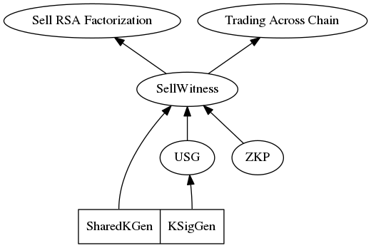

# Efficient Zero-Knowledge Contingent Payments in Cryptocurrencies Without Scripts

## Preview

### The problems this paper is trying to solve

* It is difficult to develop new Bitcoin scripts because most miners tend not to accept something new.

* Some cryptocurrencies entirely eliminate the possibility of existence of scripts, including Zerocash and the Lightning system.

* How to create non-trivial efficient smart contracts using the standard transactions only?
* To implement **Zero Knowledge Contingent Payment** contract without script.

* How to implement smart contracts with privacy?

### The ideas used to solve the problem

* Consider two-party models between a Buyer B and a Seller S.
* Implement a general **SellWitness** protocol, which is used to  construct other contracts.
  * The seller S knows the answer $a$ to some problem $x$. S can zero-knowledge prove to others that he knows $a$. The buyer B wants to buy $a$ from S.
  * They agree on a pair of public keys $(pk,sk)$, where $pk$ is known to both of them, and $sk$ is privately shared by them, i.e. together they can generate the signature, but neither of them can generate the signature alone.
  * B signs a transaction $T_1$ to put his money to the address $pk$, and keeps $T_1$ secret.
  * B and S signs transaction $T_2$ together, which spends the money in $T_1$ and gives them to S. This is done such that only S knows the signature of $T_2$. And $T_2$ is constructed in a way that publishing it will automatically reveal $a$ to B.
  * S publishes $T_1$ on the ledger.
  * To prevent $T_1$ from being locked forever, $T_1$ may have a time lock which allows B to redeem it after a specific period of time.

## Details

### SellWitness Protocol (Simple Version)

1. Buyer wants to buy the value of $x$, which the seller knows.
2. Buyer and seller agrees on $(pk_{BS}, sk_{BS})$ where $sk_{BS}$ is shared by them.
3. Buyer put the money in transaction $T_1$, with the ouput locked by $pk_{BS}$.
4. Buyer generate transaction $T_2$ spending $T_1$, with the output locked by $pk_S$.
5. Buyer sends $T_2$ to seller, together they sign $T_2$ with their shares of $sk_{BS}$, and the signature $\sigma$ is known only to the seller.
6. Seller commits to $\sigma$ and generates $cm$, sends $cm$ to the buyer, and convinces the buyer that: once $\sigma$ is revealed, the buyer will know $x$ from $cm$ and $\sigma$.
7. Seller weakly commits to his share of $sk_{BS}$ and sends to the buyer, so that the buyer can break the commitment and knows $sk_{BS}$ after some period of time.
8. Buyer publish $T_1$ and waits for the buyer to publish $T_2$.
9. If $T_2$ is published, the buyer knows $\sigma$ and thus $x$.
10. If $T_2$ is not published, the buyer breaks the weak commitment and knows $sk_{BS}$ thus redeems $T_1$.

Now the problem is how does the seller convinces the buyer that knowing $\sigma$ implies knowing $x$, and the validity of the weak commitments? This can be done via zero-knowledge proof. The method used here is the **cut-and-choose** technique.

### SharedKGen Protocol

1. Seller samples $d_S$, computes $D_S=d_S\cdot g$, buyer samples $d_B$, computes $D_B = d_B \cdot g$.
2. Seller sends $Commit(D_S)$ to buyer.
3. Buyer sends $D_B$ to seller, seller opens $D_S$ to buyer.
4. Buyer computes $pk=d_B\cdot D_S$, seller computes $pk=d_S\cdot D_B$.
5. The $sk=d_B\cdot d_S$, but nobody knows it.

### KSignGen Protocol

The seller and buyer are trying to sign a message $z$ with their shares of $sk$, i.e. $d_B$ and $d_S$. They have access to a Additional Homogeneous Encryption scheme $(Gen, Enc, Dec)$. After the procedure, the seller knows the signature while the buyer does not.

1. They run the **SharedKGen** protocol to generate $K\in\mathbb{G}$, with $k=k_B\cdot k_S$ secretly shared.
2. With $K$ they each compute $r$ in the signature.
3. Seller generates $(pk_{AH},sk_{AH})=Gen(1^{\lambda})$, computes $c_S = Enc_{pk_{AH}}(d_S)$, sends $pk_{AH}$ and $c_S$ to buyer.
4. Buyer computes $c_B = Enc(k_B^{-1}\cdot H(z))\otimes c_S^{k_B^{-1}\cdot r\cdot d_B}$ (which actually equals $Enc(k_B^{-1}(H(z)+r\cdot d))=Enc(s\cdot k_S)$), then sends $c_B$ to seller.
5. Seller decrypts $c_B$ for $s\cdot k_S$, then computes $s$ from it, let $\sigma = (r,s)$, and verifies that $\sigma$ is a valid signature of $z$.

### The USG Protocol

The idea of the USG protocol is the **cut-and-choose** technique. The purpose is to convince the buyer that the buyer sends him the correct commitment to the signatures.

1. They run the **SharedKGen** protocol $a$ times.
2. For each generated key pair:
   1. They run the **KSignGen** protocol to sign the message $z$ and the seller obtains $\sigma^i$.
   2. The seller sends $Commit(S^i)$ to the buyer, where $S^i=F(\sigma^i)$. 
   3. The seller sends $TLCommit(d_S^i)$ to the buyer, where $TLCommit$ is a time lock commitment.
3. The buyer randomly chooses $a-b$ of the above executions, for each of them:
   1. The buyer asks for $S^j$, $d_S^j$, $\sigma^j$, $k_S^j$ and $sk_{AH}^j$ from the buyer.
   2. The buyer verifies that the seller did everything as expected.

If all the $a-b$ checks succeeds, there is large probability that the remaining $b$ signature commitments are okay.

### Zero-knowledge Proof Protocol

It is assumed that there exists a zero-knowledge proof of knowledge protocol for $f$. The protocol consists of the following procedures:

* $Setup$: generates $A$ and $B$ as the reference strings used by the seller and the buyer respectively.
* $GenChallenge(B)$: used by the buyer to generate challenge $c$ for $f$.
* $GenResponse(x,A,c)$: used by the seller to generate response for the challenge.
* $VerifyResponse(B,c,r)$: used by the buyer to verify the response.
* $Extract(B,c^1,r^1,c^2,r^2)$: used by the buyer to extract $x$ from two pairs of challenge-responses.

With these procedures, the seller generates responses and encrypts them with $S$ as symmetric encryption scheme key, and sends them to the buyer. To validate the ciphertexts, this procedure is also carried out with cut-and-choose technique. Specifically, divide $S$ into $2\lambda$ pieces $S^j$ for $j=1,\cdots,2\lambda$, each of length $\lambda$ bits.

1. For $j=1$ to $2\lambda$:
   1. The parties execute $Setup$ to generate $A^j$ and $B^j$.
   2. The seller computes $c_1^j$ and $c_2^j$ that can be chosen by the buyer, and generates responses $r_1^j$ and $r_2^j$ for them.
   3. The seller encrypts $(c_1^j,r_1^j)$ and $(c_2^j,r_2^j)$ with $S^j$ respectively to obtain $\gamma_1^j$ and $\gamma_2^j$.
   4. The seller commits to $\gamma_1^j$ and $\gamma_2^j$, sending commitments to the buyer.
2. The buyer randomly select $\lambda$ indices from $\{1,\cdots,2\lambda\}$, denoted by $\mathcal{J}$.
3. For each $j\in\mathcal{J}$:
   1. The buyer sends $j$ and $c^j$ to the seller.
   2. The seller opens $S^j$ and $\gamma_k^j$ to the buyer, where $k$ is selected from $\{1,2\}$ such that $c_k^j=c^j$.
   3. The buyer checks the commitments are correct, then decrypts $\gamma_k^j$ with $S^j$ to obtain $c_k^j$ and $r_k^j$. He checks that $c_k^j=c^j$ and that $r_k^j$ is a valid zero-knowledge proof response.
4. For each $j\notin\mathcal{J}$:
   1. The seller opens both $\gamma_1^j$ and $\gamma_2^j$ to the buyer.
   2. The buyer verifies the commitments.
5. The protocol succeeds if all verifications succeed.

As a result of this protocol, the buyer obtains $\lambda$ pairs of encrypted $\gamma_1$ and $\gamma_2$ by a signature $\sigma$, assured that they are valid commitments. As a result, once the buyer learns $\sigma$, he decrypts for $(c_1,r_1)$ and $(c_2,r_2)$ and extracts $x$ from them.

This protocol would be executed $b$ times for each $\sigma$ not opened in the USG protocol.

### SellWitness Protocol (Full Version)

1. Buyer wants to buy the value of $x$, which the seller knows.
2. Buyer and seller execute the USG protocol with message $z=T_2$, where $T_1$ and $T_2$ are generated as before, with $T_1$ locked by the $a$ publick keys generated during the USG protocol, and is unlocked by providing $b$ signatures.
3. For the $b$ indices not used in the USG protocol, they execute the zero-knowledge proof protocol.
4. Buyer publishes $T_1$ and waits for the buyer to publish $T_2$ with signatures $\sigma_1, \cdots, \sigma_b$.
5. If $T_2$ is published, the buyer knows $\sigma_1,\cdots,\sigma_b$, computes $S_1,\cdots,S_b$, and use any of them to decrypt the pair of encrypted zk-proof responses, and extract $x$ from the responses.
6. If $T_2$ is not published, the buyer breaks the weak commitments and redeems $T_1$.

### Sell RSA Factorization

It suffices to specify the zero-knowledge proof protocol for RSA factorization selling protocol. The procedure proceeds as follows:

1. Buyer samples $x\leftarrow\mathbb{Z}_n^*$ such that $x<n/2$, and sends $y=x^2\mod n$ to seller.
2. The seller, knowing factorization of $n$, can easily compute square roots of $x$ (with Tonelli-Shanks algorithm), namely $r_0,r_1$, that are smaller than $n/2$. Then he sends commitments of $r_0$ and $r_1$ to the buyer.
3. The buyer sends $x$ to the seller.
4. The seller opens $r_b=x$ to the buyer together with $b$.

In the SellWitness protocol, this procedure is simplified: first the buyer sends $y^j$, then the seller calculates $r_0^j$ and $r_1^j$ as roots of $y^j$, encrypts them $\gamma_k^j=Enc_{S^j}(r_k^j)$ and commits to both $\gamma_k^j$.

If the buyer knows both $r_0^j$ and $r_1^j$ that are square roots of $y^j$ and that neither of their sum or their difference is divisible by $n$, then the buyer can factor $n$ by computing $\gcd(n,r_0^j-r_1^j)$.

### Trading Across Chain

Assume that Alice and Bob want to trade coins in cryptocurrencies $\mathcal{A}$ and $\mathcal{B}$. Alice sends coins in $\mathcal{A}$ to Bob and Bob sends coins in $\mathcal{B}$ to Alice.

1. Alice and Bob generate $d_A$ and $d_B$ seperately, and Alice **sends** $D_A=d_A\cdot g$ to Bob, Bob **commits** $D_B=d_B\cdot g$ to Alice. This procedure is repeated $a$ times. The resulting shared public keys will be used in $\mathcal{A}$ by Alice.
2. Alice and Bob execute **SellWitness** protocol in $\mathcal{B}$, where Alice sells Bob her secret shares. The difference is no zero-knowledge proof is used here, so Alice has to reveal $a-b$ of her shares to convince Bob that her commitments are correct.
3. Before Bob publishes $T_{\mathcal{B}}^1$ in the protocol, he opens his commitments to $D_B^i$ and timed commits $d_B^i$ to Alice (with longer time than the time commitment in **SellWitness**). Alice verifies the commitments by asking Bob to open $a-b$ of them.
4. Knowing the public keys, Alice uses the rest $b$ unopened $D_B^i$, together with $b$ unopened $d_A^i$ to generate $b$ public keys $pk_A^1,\cdots,pk_A^b$. Then Alice broadcasts $T_{\mathcal{A}}^1$ spending her coins to the public keys.
5. After $T_{\mathcal{A}}^1$ is on the chain, Bob broadcasts $T_{\mathcal{B}}^1$.
6. If Alice broadcasts $T_{\mathcal{B}}^2$ as in **SellWitness** protocol, Bob then knows her secret shares and spends the outputs of $T_{\mathcal{A}}^1$.
7. If Alice does not, Bob can break the timed commitments and redeem his funds, then Alice breaks her timed commitments and redeems $T_{\mathcal{A}}^1$.