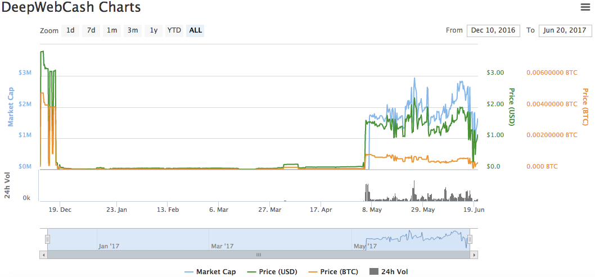

# 深网币DWC介绍

* DWC又称深网币，其英文名称为DeepWeb Cash。DWC与Zcash对比，二者都是基于比特币的设计结构，极其相似，但又有所不同。
* DWC的代币供应模式与Zcash极其相似——同样拥有一种固定的和已知的的发行模式：大约每4年产量就会产量减半一次，总供应量为2100万，平均出块间隔为2.5分钟，具有“Slow Start”模式，启动稳定后每区块coinbase奖励为12.5。这种设计是为了减少可能会出现的负面事件所带来的影响，如‘重大的bug’或者‘安全漏洞’。
* DWC与Zcash最大的区别就在于，Zcash在前四年中，将20%产生的币（即总量的10%）分配给了“开发团队，“开发团队”包括“Zcash电子货币公司”和相关雇员、投资人、顾问等。而对于DWC，开发团队没有预留任何的份额，矿工将获得100%的奖励。
* DWC还处于实验阶段。目前 DWC仅支持 linux 系统（推荐 ubuntu），不支持 Windows、MAC，且只支持命令行， 没有图形界面。DWC钱包资金分两种：透明资金以及私有资金，透明资金类似比特币资金；私有资金则加强了隐私性，涉及到私有资金的交易是保密不可查的，透明资金与透明资金的交易是公开可查的。
* DWC的挖矿和Zcash也是相同的，解决的puzzle是Equihash。挖矿速度的单位是Sol/s。目前仅支持CPU挖矿，网络总矿力在100000 Sol/s量级。四核的CPU挖矿算力约为5 Sol/s。

https://coinmarketcap.com/currencies/deepwebcash/

