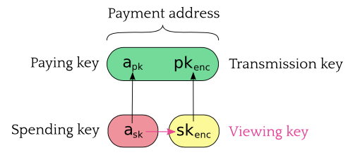
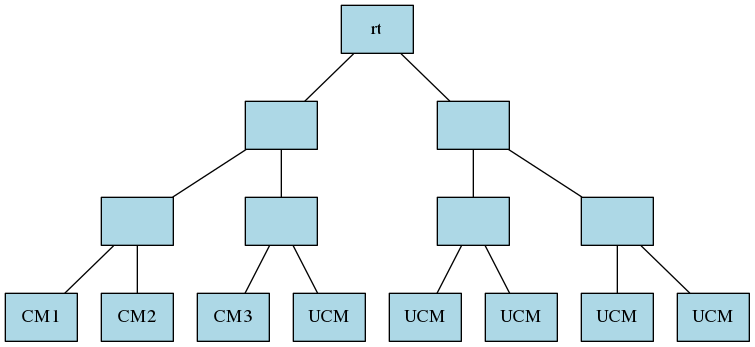

# ZCash

**Zcash** is an implementation of the Decentralized Anonymous Payment scheme **Zerocash**, with some security fixes and adjustments to terminology, functionality and performance.

## Note (Coin)

* A note is a tuple $(a_{pk},v,\rho,r)$, stored in encrypted form in transactions.
* A note plaintext is what is needed to tell the recipient so that he can spend a note. It is a tuple $(v,\rho,r,memo)$ where the usage of $memo$ is reserved for the sender and recipient. A note plaintext is encrypted to note ciphertext $C$ and appended in a **JoinSplit**.
* Note commitment is computed in one step, using only one trapdoor $r$, by $$cm = \mathbf{COMM}_r(a_{pk},v,\rho)$$
* All note commitments form a Merkle tree.

## Nullifier (Serial number)

* Nullifier $nf$ plays the role of Serial Number $sn$. Computed by $$nf = \mathbb{PRF}^{nf}_{a_{sk}}(\rho)$$ as in **Zerocash**.

* For security reason, $\rho$ is no longer randomly sampled directly, but computed by $$\rho_i^{new}=PRF_{\varphi}^{\rho}(i,h_{Sig})$$ where $\varphi$ is randomly sampled and computation of $h_{Sig}$ is described below.

## JoinSplit (Mint/Pour transaction)

No special transactions like mint/pour, all transactions are the same.
Add to each bitcoin transaction a (possibly empty) list of **JoinSplit**, which plays the role of both mint and pour transactions.

* A **JoinSplit** is similar to pour transaction with an additional $v_{pub}^{old}$, and requires that either $v_{pub}^{old}$ or $v_{pub}^{new}$ must be zero. When $v_{pub}^{old}$ is nonzero, the JoinSplit plays the role of a mint transaction.
* Each JoinSplit consists of $$(v_{pub}^{old},v_{pub}^{new},rt,nf_{1..2}^{old},cm_{1..2}^{new},epk,randomSeed,h_{1..2},\pi_{JoinSplit},C_{1..2}^{enc})$$
 - $epk$: is a key agreement public key, used to derive the key for encryption of $C_{1..2}^{enc}$
 - $randomSeed$: must be choosen independently for each JoinSplit
 - $C_{1..2}^{enc}$ is encryption of note plaintext. The $C_{new}^i$ are encrypted by symmetric encryption scheme where the key is generated from some key agreement  schem. Specifically, a freshly generated public key $epk$ is appended in a **JoinSplit**, and the ciphertext $C_{new}^i$ is encrypted by a key computed by $$KDF(i,h_{Sig},KeyAgree(esk,pk_{enc,i}),epk,pk_{enc,i})$$ where $esk$ is the private key of $epk$.

* One transaction consists of **one** $JoinSplitPubKey$ used for all **JoinSplits**, then for each **JoinSplit** the $h_{Sig}$ is computed by $$h_{Sig}=hSigCRH(randomSeed,nf_{1..2}^{old},JoinSplitPubKey)$$ where $hSigCRH$ is instantiated to be `BLAKE2b-256("ZcashComputehSig",...)`. This $h_{Sig}$ is not stored in the transaction and can be computed whenever needed.
* The entire transaction is signed by $JoinSplitPubKey$, the signature is appended in the transaction.

## Payment address (Address public key)

​	
## Merkle Tree

* Initialized to be filled with $2^h$ leaves of value $Uncommited$ 
* Each new commitment occupies the next position $i$ of $Uncommitted$.
* The Hash function for Merkle tree is denoted by $MerkleCRH$.
* In Zcash:
 * $Uncommited$ is instantiated to be all-zero.
 * The depth of Merkle tree is instantiated to be $29$.

## Proof of Work

Zcash uses **Equihash** as its Proof of Work.

* An instance of the Equihash algorithm is parameterized by integers $n$ and $k$, such that $n$ is multiple of $k+1$. In Zcash, $n=200$ and $k=9$.
* The **General Birthday Problem** is: given a sequence of $\{X_i\}_{i=1}^N$ of $n$-bit strings find $2^k$ distinct $X_{i_j}$ such that $\bigoplus\limits_{j=1}^{2^k} X_{i_j}=0$.
* In Equihash, $N=2^{\frac{n}{k+1}+1}$, and the sequence $\{X_i\}_{i=1}^N$ is derived from the **block header and a nonce** (denote by $S$) by $$X_i = EquihashGen_{n,k}(S,i)$$
* $EquihashGen_{n,k}(S,i)$ is defined to be $T_{h+1},\cdots,T_{h+n}$, where $h=(i-1\mod m)\cdot n$ and $$T = \text{BLAKE2b-}(n\cdot m)(powtag,S\|floor((i-1)/m))$$ where $m=floor(512/n)$.
* A valid Equihash solution is a sequence of indices $i_j$ of $\{X_i\}_{i=1}^N$ satisfies:
 - Generalized Birthday condition
 - For all $r\in\{1,\cdots,k-1\}$, divide the $2^k$ indices into $2^{k-r}$ groups each of size $2^r$, then each group satisfies a "weaker" Generalized Birthday condition: summation has $nr/(k+1)$ leading zeros. And in each group, the left half number of indices are lexicographically less than the right half.
* Until now we have not mentioned the difficulty condition. Encode the solution into bit-array with I2BSP, then the solution satisfies the difficulty condition if the **hash of the block header** with solution field set to this encoding has sufficient number of leading zeros.