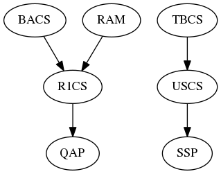

# Libsnark

[Libsnark](https://github.com/scipr-lab/libsnark) 是 SCIPR 实验室（即 Ben-Sasson 等）基于他们提出的 zk-SNARK 方案实现的。该库依赖于同为 SCIPR 实验室写的 libff （椭圆曲线）库和 libfqfft （快速傅里叶变换）库。

和 SCIPR 的 zk-SNARK 理论不同的是，libsnark 库不仅支持输入 Circuit 编码的 NP 问题，还支持其他多种编码方式，总共有如下几种

- R1CS (Rank-1 Constraint Systems)
- BACS (Bilinear Arithmetic Circuit Satisfiability) 也就是上述 Circuit
- USCS (Unitary-Square Constraint Systems)
- TBCS (Two-input Boolean Circuit Satisfiability)
- TinyRAM

内部实现上，libsnark实现了这些问题间的相互转化。libsnark将各种问题（包括BACS）转为 R1CS，最终再将 R1CS 转化为 QAP 问题。只有 TBCS 和 USCS 例外，没有走 R1CS 个 QAP 的路径，而是采用了 TBCS->USCS->SSP 的转化方式。

R1CS 和 QAP 非常相似，只是把多项式换成域$\mathbb{F}$中的元素，并去掉$Z$（因为是域而不再是环，不存在不整除的情况）。

Libsnark 没有提供从 C 语言到 TinyRAM 或者任何编码方式的编译器。任何NP问题需要手动编码。编码结果参照源代码中给的例子用 C++ 表示出来，和 libsnark.a 链接编译。

需要注意的是，libsnark把zk-SNARK和preprocessing zk-SNARK做了区分，其中preprocessing zk-SNARK指的是之前zk-SNARK的概念，也就是需要首先将NP问题进行“预处理”转化为proving key和verification key等公开参数。而这里的zk-SNARK指的是不需要预处理的通用零知识证明，生成公开参数只需要提供程序大小限制，运行步数限制等信息。进行零知识证明时，需要将汇编程序连同proving key和公开输入一起输入prover。

## libff

### common

- 一个复数类的接口，在标准库`std::complex<double>`外的包装，额外提供了下面的接口。

```c++
// common/double.hpp
class Double {
  static Double one();
  static Double zero();
  static Double random_element();
  static Double geometric_generator();
  static Double arithmetic_generator();
}
```

- 用SHA512实现的随机域元素产生器。要求`FieldT`类型支持从`bigint`初始化。

```c++
// common/rng.hpp
FieldT SHA512_rng<FieldT>(const uint64_t idx);
```

### algebra

- libff实现的大整数类（在gmp上的一层包装），支持最基本的大整数运算，输入和输出等操作，可以从`unsigned long`，十进制的字符串`const char *`以及gmp的大整数类型`mpz_t`初始化。

```c++
// algebra/bigint.hpp
class bigint<mp_size_t n>;
```

- libff提供的有限域类，提供有限域元素的基本运算和操作。以后遇到的所有模板类中命名为`FieldT`的类型基本上都是用这些类来实现的。这里`p`是`bigint<n>`类型。

```c++
// algebra/fp*.hpp
class Fp_model<n,p>; // 素数域
class Fp2_model<n,p>; // F_{p^2}
class Fp3_model<n,p>; // F_{p^3}
class Fp4_model<n,p>; // F_{p^4}
class Fp6_2over3_model<n,p>; // F_{(p^3)^2}
class Fp6_3over2_model<n,p>; // F_{(p^2)^3}
class Fp12_2over3over2_model<n,p>; // F_{((p^2)^3)^2}
```

- libff提供了若干“类”曲线，每一类曲线都实现了三个群`G1`，`G2`和`GT`，用来实现pairing操作。然后给每一类曲线定义了一个public parameter类（如`bn128`曲线的`bn128_pp`类），在这个类中`typedef`了`Fp_type`，`Fq_type`，`G1_type`，`G2_type`和`GT_type`等类型。需要使用`bn128`曲线时，将`bn128_pp`作为模板类型参数。

```c++
// algebra/curves/*/*_pp.hpp
class bn128_pp {
  typedef bn128_Fr Fp_type;
  typedef bn128_G1 G1_type;
  typedef bn128_G2 G2_type;
  typedef bn128_Fq Fq_type;
  typedef bn128_GT GT_type;
};
class alt_bn128_pp {
  typedef alt_bn128_Fr Fp_type;
  typedef alt_bn128_G1 G1_type;
  typedef alt_bn128_G2 G2_type;
  typedef alt_bn128_Fq Fq_type;
  typedef alt_bn128_GT GT_type;
};
class edwards_pp {
  typedef edwards_Fr Fp_type;
  typedef edwards_G1 G1_type;
  typedef edwards_G2 G2_type;
  typedef edwards_Fq Fq_type;
  typedef edwards_GT GT_type;
};
```

每个上述public parameter类（用`EC_ppT`表示）都提供如下接口

```c++
// algebra/curves/*/*_pp.hpp
void init_public_params();
GT<EC_ppT> final_exponentiation(const Fqk<EC_ppT> &elt);
Fqk<EC_ppT> pairing(const G1<EC_ppT> &P,
                    const G2<EC_ppT> &Q);
GT<EC_ppT> reduced_pairing(const G1<EC_ppT> &P,
                           const G2<EC_ppT> &Q);
GT<EC_ppT> affine_reduced_pairing(const G1<EC_ppT> &P,
                                  const G2<EC_ppT> &Q);
```

这里`GT<EC_ppT>`等类型都是如下简写

```c++
// algebra/curves/public_params.hpp
using Fr = typename EC_ppT::Fp_type;
using G1 = typename EC_ppT::G1_type;
using G2 = typename EC_ppT::G2_type;
using Fq = typename EC_ppT::Fq_type;
using Fqk = typename EC_ppT::Fqk_type;
using GT = typename EC_ppT::GT_type;
```

最后提供了点的标量乘法的接口。这里`GroupT`应该用一个椭圆曲线类（如`bn128_G1`）。

```c++
// algebra/curves/curve_utils.hpp
GroupT scalar_mul<GroupT, m>(const GroupT &base, const bigint<m> &scalar);
```

## libsnark

现在我们来看一下libsnark这个库提供了哪些类和接口。首先是`common`文件夹。

```
common/
  data_structures/
  default_types/
```

其中data_structures提供了一些相对独立的数据结构的实现，类似于标准模板库。

```c++
class sparse_vector<T>;
class set_commitment_accumulator<HashT>;
class merkle_tree<HashT>;
class integer_permutation;
class accumulation_vector<T>;
```

这里`T`基本可以取任意类型，但`HashT`需要是满足一定条件（实现了某些接口）的类。`HashT`的类型直到需要时才会具体实现，在不涉及具体实现时，只用`HashT`来指代。

`default_types`文件夹里所有的文件只做一件事，那就是把`libff`中给的`default_ec_pp`类型（如`bn128_pp`或`edwards_pp`等）重定义成各种`snark`要用到的曲线的默认类型。所以，接下来碰到的所有如`default_r1cs_ppzksnark_pp`的类型全部都是从一个祖先`libff::default_ec_pp`定义过去的。具体的选择是在编译的时候通过传给编译器的宏参数确定的（如果编译时不传这个参数，会导致`default_ec_pp`没有定义，编译会出错）。

另一个比较简单的文件夹是`knowledge_commitment`，主要是提供了一个类也就是`knowledge_commitment<T1,T2>`。这里`T1,T2`都是群元素类型。所谓的`knowledge commitment`可以看做是在两个加群的笛卡尔积上定义了一个加法运算得到的群，也就是对应元素相加。

最主要的`zksnark`的功能实现在`relations`，`reductions`和`zk_proof_systems`三个文件夹中。依赖关系为后者依赖前者。

### Relations

`relations`中定义了所有问题（QAP和SSP）的实例（`instance`）以及`witness`，和所有“限制系统”（BACS，TBCS，R1CS和USCS）的实例，赋值和输入等。其中基于Circuit的系统（BACS和TBCS）的实例为类`bacs_circuit`和`tbcs_circuit`，另外两个限制系统则分别是`r1cs_constraint_system`和`uscs_constraint_system`。所有这些限制系统都有一个`variable_assignment`，一个`primary_input`和一个`auxiliary_input`类型（这些输入类型都是用C++标准库`vector<FieldT>`定义的）。

```c++
class qap_instance<FieldT>;
class qap_instance_evaluation<FieldT>;
class qap_witness<FieldT>;

class ssp_instance<FieldT>;
class ssp_instance_evaluation<FieldT>;
class ssp_witness<FieldT>;

class bacs_gate<FieldT>;
class bacs_circuit<FieldT>;
typedef std::vector<FieldT> bacs_primary_input<FieldT>;
typedef std::vector<FieldT> bacs_auxiliary_input<FieldT>;
typedef std::vector<FieldT> bacs_variable_assignment<FieldT>;

class tbcs_gate<FieldT>;
class tbcs_circuit<FieldT>;
typedef std::vector<FieldT> tbcs_primary_input<FieldT>;
typedef std::vector<FieldT> tbcs_auxiliary_input<FieldT>;
typedef std::vector<FieldT> tbcs_variable_assignment<FieldT>;

class r1cs_constraint<FieldT>;
class r1cs_constraint_system<FieldT>;
typedef std::vector<FieldT> r1cs_primary_input<FieldT>;
typedef std::vector<FieldT> r1cs_auxiliary_input<FieldT>;
typedef std::vector<FieldT> r1cs_variable_assignment<FieldT>;

class uscs_constraint<FieldT>;
class uscs_constraint_system<FieldT>;
typedef std::vector<FieldT> uscs_primary_input<FieldT>;
typedef std::vector<FieldT> uscs_auxiliary_input<FieldT>;
typedef std::vector<FieldT> uscs_variable_assignment<FieldT>;
```

`relations`文件夹中还定义了一个虚类`memory_interface`，支持存储和读取`size_t`类型的数据和内存地址。然后给出了两个实现，一个是用`std::map<size_t,size_t>`实现的`ra_memory`，一个是用`merkle_tree<HashT>`实现的`delegated_ra_memory<HashT>`。

基于`memory_interface`，程序定义了两个架构`fooram`和`tinyram`。在`rams`文件夹里并没有给出具体实现，而是定义了它们的parameter，分别是`ram_fooram`和`ram_tinyram`。和libff中的椭圆曲线的public parameters一样，这两个类也都统一定义了如下类型：

```c++
class ram_fooram<FieldT> {
    typedef FieldT base_field_type;
    typedef fooram_protoboard<FieldT> protoboard_type;
    typedef fooram_gadget<FieldT> gadget_base_type;
    typedef fooram_cpu_checker<FieldT> cpu_checker_type;
    typedef fooram_architecture_params architecture_params_type;
};
class ram_tinyram<FieldT> {
    typedef FieldT base_field_type;
    typedef tinyram_protoboard<FieldT> protoboard_type;
    typedef tinyram_gadget<FieldT> gadget_base_type;
    typedef tinyram_cpu_checker<FieldT> cpu_checker_type;
    typedef tinyram_architecture_params architecture_params_type;
};
```

上面的`protoboard`，`gadget`和`cpu_checker`都是在`gadgetlib1`里定义的。而`fooram_architecture_params`和`tinyram_architecture_params`则分别是在同一文件夹下的`fooram_aux.hpp`和`tinyram_aux.hpp`中定义的。

接下来在`ram_params.hpp`中将上述类型进行了简写

```c++
using ram_base_field<ramT> = typename ramT::base_field_type;
using ram_protoboard<ramT> = typename ramT::protoboard_type;
using ram_gadget_base<ramT> = typename ramT::gadget_base_type;
using ram_cpu_checker<ramT> = typename ramT::cpu_checker_type;
using ram_architecture_params<ramT> = typename ramT::architecture_params_type;
```

接下来，凡是命名为`ramT`的模板类型名，都是由`ram_fooram`或者`ram_tinyram`实现的。

最后，`ram_computations`文件夹中还给出了变量（`variable<FieldT>`）、线性项（`linear_term<FieldT>`）以及线性组合（`linear_combination<FieldT>`）这三个类。其中`variable`仅存储一个整数`index`表示`x_i`，`linear_term`存储一个`variable`和一个`FieldT`类型的系数表示`a_ix_i`，最后`linear_combination`存储了一个`std::vector<linear_term>`，表示一个线性组合`a_0x_0+...+a_nx_n`。

### Reductions

下面是各个`relation`之间的约化关系。



除了从`ram`到`r1cs`的约化外，其他四个约化过程都是由全局函数来定义的。但`ram`的约化过程比较复杂，程序中定义了一个类`ram_to_r1cs`，从参数初始化好一个对象，再调用`get_constraint_system`成员函数来得到`r1cs`的实例。

下面是除了`ram`的约化之外程序给出的所有约化函数声明。

```c++
r1cs_constraint_system<FieldT> bacs_to_r1cs_instance_map(
    const bacs_circuit<FieldT> &circuit);

r1cs_variable_assignment<FieldT> bacs_to_r1cs_witness_map(
    const bacs_circuit<FieldT> &circuit,
    const bacs_primary_input<FieldT> &primary_input,
    const bacs_auxiliary_input<FieldT> &auxiliary_input);
    
uscs_constraint_system<FieldT> tbcs_to_uscs_instance_map(
    const tbcs_circuit &circuit);

uscs_variable_assignment<FieldT> tbcs_to_uscs_witness_map(
    const tbcs_circuit &circuit,
    const tbcs_primary_input &primary_input,
    const tbcs_auxiliary_input &auxiliary_input);

qap_instance<FieldT> r1cs_to_qap_instance_map(
    const r1cs_constraint_system<FieldT> &cs);
    
qap_witness<FieldT> r1cs_to_qap_witness_map(
    const r1cs_constraint_system<FieldT> &cs,
    const r1cs_auxiliary_input<FieldT> &auxiliary_input,
    const FieldT &d1, const FieldT &d2, const FieldT &d3);

ssp_instance<FieldT> uscs_to_ssp_instance_map(
    const uscs_constraint_system<FieldT> &cs);
    
ssp_witness<FieldT> uscs_to_ssp_witness_map(
    const uscs_constraint_system<FieldT> &cs,
    const uscs_primary_input<FieldT> &primary_input,
    const uscs_auxiliary_input<FieldT> &auxiliary_input,
    const FieldT &d);
```

而对`ram`的约化，定义了如下一个类。注意到它的输入只有三个参数，`ram`的架构类型（即`fooram_architecture_params`或`tinyram_architecture_params`），和程序大小运行时间限制。因此这个`ram`是通用的，即描述NP问题的程序不会被编码进R1CS问题中，而是将来作为输入传进。

```c++
class ram_to_r1cs<ramT> {
    ram_to_r1cs(const ram_architecture_params<ramT> &ap,
                const size_t boot_trace_size_bound,
                const size_t time_bound);
    r1cs_constraint_system<FieldT> get_constraint_system() const;
    r1cs_auxiliary_input<FieldT> auxiliary_input_map(
        const ram_boot_trace<ramT> &boot_trace,
        const ram_input_tape<ramT> &auxiliary_input);
    static r1cs_primary_input<ram_base_field<ramT> > primary_input_map(
        const ram_architecture_params<ramT> &ap,
        const size_t boot_trace_size_bound,
        const ram_boot_trace<ramT>& boot_trace);
};
```

### zk\_proof\_systems

这里主要是为每个限制系统提供四个类，`proving_key`，`verification_key`，`keypair`和`proof`，和三个全局函数`generator`，`prover`和`verifier`。

首先介绍的是通用zk-SNARK的接口。注意到它的`generator`函数只有`ram`架构信息作为参数。程序需要在`prover`和`verifier`中作为`primary_input`传入。

```c++
// ram_zksnark.hpp
class  ram_zksnark_proving_key< ram_zksnark_ppT >
class  ram_zksnark_verification_key< ram_zksnark_ppT >
struct ram_zksnark_keypair< ram_zksnark_ppT >
class  ram_zksnark_proof< ram_zksnark_ppT >
ram_zksnark_keypair< ram_zksnark_ppT > ram_zksnark_generator (
    const ram_zksnark_architecture_params< ram_zksnark_ppT > &ap)
ram_zksnark_proof< ram_zksnark_ppT > ram_zksnark_prover (
    const ram_zksnark_proving_key< ram_zksnark_ppT > &pk,
    const ram_zksnark_primary_input< ram_zksnark_ppT > &primary_input,
    const size_t time_bound,
    const ram_zksnark_auxiliary_input< ram_zksnark_ppT > &auxiliary_input)
bool ram_zksnark_verifier (
    const ram_zksnark_verification_key< ram_zksnark_ppT > &vk,
    const ram_zksnark_primary_input< ram_zksnark_ppT > &primary_input,
    const size_t time_bound,
    const ram_zksnark_proof< ram_zksnark_ppT > &proof)
```

接下来是六类限制系统的 preprocessing zk-SNARK，简写为`ppzksnark`。

```c++
// bacs_ppzksnark.hpp
class bacs_ppzksnark_proving_key< ppT >
class bacs_ppzksnark_keypair< ppT >

bacs_ppzksnark_keypair< ppT > bacs_ppzksnark_generator (
    const bacs_ppzksnark_circuit< ppT > &circuit)
 
bacs_ppzksnark_proof< ppT > bacs_ppzksnark_prover (
	const bacs_ppzksnark_proving_key< ppT > &pk,
	const bacs_ppzksnark_primary_input< ppT > &primary_input,
	const bacs_ppzksnark_auxiliary_input< ppT > &auxiliary_input)
 
bool bacs_ppzksnark_verifier_weak_IC (
    const bacs_ppzksnark_verification_key< ppT > &vk,
    const bacs_ppzksnark_primary_input< ppT > &primary_input,
    const bacs_ppzksnark_proof< ppT > &proof)
 
bool bacs_ppzksnark_verifier_strong_IC (
    const bacs_ppzksnark_verification_key< ppT > &vk,
    const bacs_ppzksnark_primary_input< ppT > &primary_input,
    const bacs_ppzksnark_proof< ppT > &proof)
```

```c++
// r1cs_gg_ppzksnark.hpp
class r1cs_gg_ppzksnark_proving_key< ppT >
class r1cs_gg_ppzksnark_verification_key< ppT >
class r1cs_gg_ppzksnark_keypair< ppT >
class r1cs_gg_ppzksnark_proof< ppT >

r1cs_gg_ppzksnark_keypair< ppT > r1cs_gg_ppzksnark_generator (
    const r1cs_gg_ppzksnark_constraint_system< ppT > &cs)
 
r1cs_gg_ppzksnark_proof< ppT > r1cs_gg_ppzksnark_prover (
    const r1cs_gg_ppzksnark_proving_key< ppT > &pk,
    const r1cs_gg_ppzksnark_primary_input< ppT > &primary_input,
    const r1cs_gg_ppzksnark_auxiliary_input< ppT > &auxiliary_input)
 
bool r1cs_gg_ppzksnark_verifier_weak_IC (
    const r1cs_gg_ppzksnark_verification_key< ppT > &vk,
    const r1cs_gg_ppzksnark_primary_input< ppT > &primary_input,
    const r1cs_gg_ppzksnark_proof< ppT > &proof)
 
bool r1cs_gg_ppzksnark_verifier_strong_IC (
    const r1cs_gg_ppzksnark_verification_key< ppT > &vk,
    const r1cs_gg_ppzksnark_primary_input< ppT > &primary_input,
    const r1cs_gg_ppzksnark_proof< ppT > &proof)
```

```c++
// r1cs_ppzksnark.hpp
class r1cs_ppzksnark_proving_key< ppT > 
class r1cs_ppzksnark_verification_key< ppT >
class r1cs_ppzksnark_keypair< ppT >
class r1cs_ppzksnark_proof< ppT >

r1cs_ppzksnark_keypair< ppT > r1cs_ppzksnark_generator (
    const r1cs_ppzksnark_constraint_system< ppT > &cs)
 
r1cs_ppzksnark_proof< ppT > r1cs_ppzksnark_prover (
    const r1cs_ppzksnark_proving_key< ppT > &pk,
    const r1cs_ppzksnark_primary_input< ppT > &primary_input,
    const r1cs_ppzksnark_auxiliary_input< ppT > &auxiliary_input)
 
bool r1cs_ppzksnark_verifier_weak_IC (
    const r1cs_ppzksnark_verification_key< ppT > &vk,
    const r1cs_ppzksnark_primary_input< ppT > &primary_input,
    const r1cs_ppzksnark_proof< ppT > &proof)

bool r1cs_ppzksnark_verifier_strong_IC (
    const r1cs_ppzksnark_verification_key< ppT > &vk,
    const r1cs_ppzksnark_primary_input< ppT > &primary_input,
    const r1cs_ppzksnark_proof< ppT > &proof)
```

```c++
// ram_ppzksnark.hpp
class  ram_ppzksnark_proving_key< ram_ppzksnark_ppT > 
class  ram_ppzksnark_verification_key< ram_ppzksnark_ppT >
struct ram_ppzksnark_keypair< ram_ppzksnark_ppT >
using  ram_ppzksnark_proof =
    r1cs_ppzksnark_proof< ram_ppzksnark_snark_pp< ram_ppzksnark_ppT > >

ram_ppzksnark_keypair< ram_ppzksnark_ppT > ram_ppzksnark_generator (
    const ram_ppzksnark_architecture_params< ram_ppzksnark_ppT > &ap,
    const size_t primary_input_size_bound, const size_t time_bound)
 
ram_ppzksnark_proof< ram_ppzksnark_ppT > ram_ppzksnark_prover (
    const ram_ppzksnark_proving_key< ram_ppzksnark_ppT > &pk,
    const ram_ppzksnark_primary_input< ram_ppzksnark_ppT > &primary_input,
    const ram_ppzksnark_auxiliary_input< ram_ppzksnark_ppT > &auxiliary_input)
 
bool ram_ppzksnark_verifier (
    const ram_ppzksnark_verification_key< ram_ppzksnark_ppT > &vk,
    const ram_ppzksnark_primary_input< ram_ppzksnark_ppT > &primary_input,
    const ram_ppzksnark_proof< ram_ppzksnark_ppT > &proof)
```

```c++
// tbcs_ppzksnark.hpp
class tbcs_ppzksnark_proving_key< ppT >
class tbcs_ppzksnark_keypair< ppT >
using tbcs_ppzksnark_verification_key = uscs_ppzksnark_verification_key< ppT >
using tbcs_ppzksnark_proof = uscs_ppzksnark_proof< ppT >

tbcs_ppzksnark_keypair< ppT > tbcs_ppzksnark_generator (
    const tbcs_ppzksnark_circuit &circuit)
 
tbcs_ppzksnark_proof< ppT > tbcs_ppzksnark_prover (
    const tbcs_ppzksnark_proving_key< ppT > &pk, 
    const tbcs_ppzksnark_primary_input &primary_input,
    const tbcs_ppzksnark_auxiliary_input &auxiliary_input)
 
bool tbcs_ppzksnark_verifier_weak_IC (
    const tbcs_ppzksnark_verification_key< ppT > &vk, 
    const tbcs_ppzksnark_primary_input &primary_input,
    const tbcs_ppzksnark_proof< ppT > &proof)
 
bool tbcs_ppzksnark_verifier_strong_IC (
    const tbcs_ppzksnark_verification_key< ppT > &vk, 
    const tbcs_ppzksnark_primary_input &primary_input, 
    const tbcs_ppzksnark_proof< ppT > &proof)
```

```c++
// uscs_ppzksnark.hpp
uscs_ppzksnark_keypair< ppT > uscs_ppzksnark_generator (
    const uscs_ppzksnark_constraint_system< ppT > &cs)

uscs_ppzksnark_proof< ppT > uscs_ppzksnark_prover (
    const uscs_ppzksnark_proving_key< ppT > &pk,
    const uscs_ppzksnark_primary_input< ppT > &primary_input, 
    const uscs_ppzksnark_auxiliary_input< ppT > &auxiliary_input)

bool uscs_ppzksnark_verifier_weak_IC (
    const uscs_ppzksnark_verification_key< ppT > &vk, 
    const uscs_ppzksnark_primary_input< ppT > &primary_input, 
    const uscs_ppzksnark_proof< ppT > &proof)

bool uscs_ppzksnark_verifier_strong_IC (
    const uscs_ppzksnark_verification_key< ppT > &vk, 
    const uscs_ppzksnark_primary_input< ppT > &primary_input, 
    const uscs_ppzksnark_proof< ppT > &proof)
```

### Gadgetlib1 和 Gadgetlib2

这两个gadget库是libsnark的作者设计来帮助使用者构造自己的限制系统的，特别地，它们是用来构造R1CS系统的。它们提供了一些常用的模块，比如计算sha256压缩函数的gate。

Gadgetlib1和libsnark其他模块之间的依赖关系还很强，这个模块本来应该架设在高层，不被任何libsnark中的基础模块所依赖，但libsnark并没有完全将其独立出来。相比之下，gadgetlib2的独立性非常强，没有被任何其他模块依赖。实际上，gadgetlib2的代码风格就和其他模块完全不同，变量命名方法为驼峰式，这也保证了其他模块不可能引用它的内容。

使用这些gadgets时，可以想象成在一个电路板（protoboard）上放置许多引脚（variable），然后用门（gadget）把这些引脚连接起来。Gadgetlib提供了protoboard类，和相对应的variable类。首先需要手动（在纸上）把NP问题用这些gadgets拼接成电路（因为Hash函数等功能已经被集成，这一步比较简单），然后按照图纸把这个电路写成C++代码。写的方式如下：

1. 构造一个protoboard，以及上面的所有variable；
2. 构造每个gadget，然后调用`get_r1cs_constraints()`函数；

至此，这个电路板已经完成了。当我们需要调用`r1cs_ppzksnark_generator()`函数时，需要一个`r1cs_constraint_system`对象，这时我们调用protoboard的`generate_constraint_system()`接口，得到所需的R1CS系统。当我们需要调用`r1cs_ppzksnark_prover()`函数时，需要`r1cs_primary_input`和`r1cs_auxiliary_input`对象，我们可以调用protoboard的`val()`接口给所有输入变量赋值，然后调用每个gadget的`generate_r1cs_witness()`接口，最后调用protoboard的`primary_input()`和`auxiliary_input()`接口。

Gadgetlib1中的gadget都提供了成员函数`generate_r1cs_constraints()`和`generate_r1cs_witness()`这两个接口，其protoboard提供了成员函数`generate_constraint_system()`和`primary_input(), auxiliary_input()`接口。相对应的，Gadgetlib2的每个gadget都提供了`generateConstraints()`和`generateWitness()`接口，以及全局函数`get_constraint_system_from_gadgetlib2(protoboard)`和`get_variable_assignment_from_gadgetlib(protoboard)`接口。

### 简单的零知识证明范例

```c++
/*************/
/* example.c */
/*************/
#include <iostream>
#include "common/default_types/ec_pp.hpp"
#include "common/default_types/r1cs_ppzksnark_pp.hpp"
#include "gadgetlib1/gadgets/basic_gadgets.hpp"
#include "zk_proof_systems/ppzksnark/r1cs_ppzksnark/r1cs_ppzksnark.hpp"

using namespace std;
using namespace libsnark;

/**
 * In this example, we show a very simple zero-knowledge proving procedure
 * using the r1cs ppzksnark proof system.
 *
 * In this simple example, we show that given vector x = (1,1,1,1,1,1,1,1,1,1)
 * we know another vector a such that: inner_product(x,a)=0
 * (yes, I know this is a trivial problem, but let's just focus on the ideas)
 */

int main() {
  constexpr size_t dimension = 10; // Dimension of the vector
  using ppT = default_r1cs_ppzksnark_pp; // Use the default public parameters
  using FieldT = ppT::Fp_type; // ppT is a specification for a collection of types, among which Fp_type is the base field
  const auto one = FieldT::one(); // constant
  std::vector<FieldT> public_input{one,one,one,one,one,one,one,one,one,one}; // x = (1,1,1,1,1,1,1,1,1,1)
  std::vector<FieldT> secret_input{one,-one,one,-one,one,-one,one,-one,one,-one}; // our secret a such that <x,a> = 0

  /*********************************/
  /* Everybody: Design the circuit */
  /*********************************/
  protoboard<FieldT> pb; // The board to allocate gadgets
  pb_variable_array<FieldT> A; // The input wires (anchor) for x
  pb_variable_array<FieldT> B; // The input wires (anchor) for a
  pb_variable<FieldT> res; // The output wire (anchor)

  ppT::init_public_params(); // Initialize the libsnark
  /* Allocate the anchors on the protoboard.
   * Note: all the public input anchors must be allocated first before
   * any other anchors. The reason is that libsnark simply treats the first
   * num_inputs() number of anchors as primary_input for the r1cs, and the
   * rest as auxiliary_input. */
  A.allocate(pb, dimension, "A");
  B.allocate(pb, dimension, "B");
  res.allocate(pb, "res");
  /* Connect the anchors by a inner_product computing gadget, specifying the
   * relationship for the anchors (A,B and res) to satisfy.
   * Note that this gadget introduces a lot more (to be accurate, 9) anchors
   * on the protoboard. Now there are 30 anchors in total. */
  inner_product_gadget<FieldT> compute_inner_product(pb, A, B, res, "compute_inner_product");

  /* Set the first **dimension** number of anchors as public inputs. */
  pb.set_input_sizes(dimension);
  /* Compute R1CS constraints resulted from the inner product gadget. */
  compute_inner_product.generate_r1cs_constraints();
  /* Don't forget another constraint that the output must be zero */
  generate_r1cs_equals_const_constraint(pb,pb_linear_combination<FieldT>(res),FieldT::zero());
  /* Finally, extract the resulting R1CS constraint system */
  auto cs = pb.get_constraint_system();

  /***************************************/
  /* Trusted Third Party: Key generation */
  /***************************************/
  auto keypair = r1cs_ppzksnark_generator<ppT>(pb.get_constraint_system());

  /**************************************************/
  /* Prover: Fill in both inputs and generate proof */
  /**************************************************/
  for (size_t i = 0; i < dimension; i++)
  {
    pb.val(A[i]) = public_input[i];
    pb.val(B[i]) = secret_input[i];
  }

  /* We just set the value of the input anchors,
   * now execute this function to function the gadget and fill in the other
   * anchors */
  compute_inner_product.generate_r1cs_witness();
  auto pi = pb.primary_input();
  auto ai = pb.auxiliary_input();
  /* If res is not zero, this function will crash complaining that
   * the R1CS constraint system is not satisfied. */
  auto proof = r1cs_ppzksnark_prover<ppT>(keypair.pk,pi,ai);

  /********************************************/
  /* Verifier: fill in only the public inputs */
  /********************************************/
  for (size_t i = 0; i < dimension; i++)  // Actually, primary_input is a std::vector<FieldT>,
    pb.val(A[i]) = public_input[i];       // we can just cast or copy the public_input to get primary input,
  pi = pb.primary_input();                // but let's pretend that we don't know the implementation details

  if(r1cs_ppzksnark_verifier_strong_IC<ppT>(keypair.vk,pi,proof)) {
    cout << "Verified!" << endl;
  } else {
    cout << "Failed to verify!" << endl;
  }

  return 0;
}
```

编译所需的Makefile如下

```Makefile
OPTIONS = -std=c++11 -DCURVE_ALT_BN128 -DNO_PROCPS -ggdb
INCLUDE = -I../libsnark/src -I../libsnark/third_party -I../libff/src -I../libff/third_party -I../libfqfft/src
LIBPATH = -L../libsnark/build/src -L../libsnark/build/third_party -L../libff/build/src
LIBS    = -lsnark -lff -lzm -lgmp -lstdc++ -lprocps -lgmpxx
GCC			= g++

circuit: main.cpp
	$(GCC) $< -o $@ $(OPTIONS) $(INCLUDE) $(LIBPATH) $(LIBS)
```

这里`libsnark`和`libff`以及`libfqfft`都是编译过的文件夹，和`example.c`所在的目录并列。